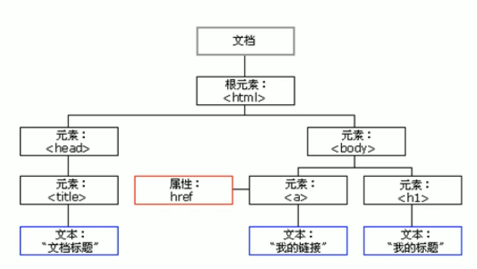
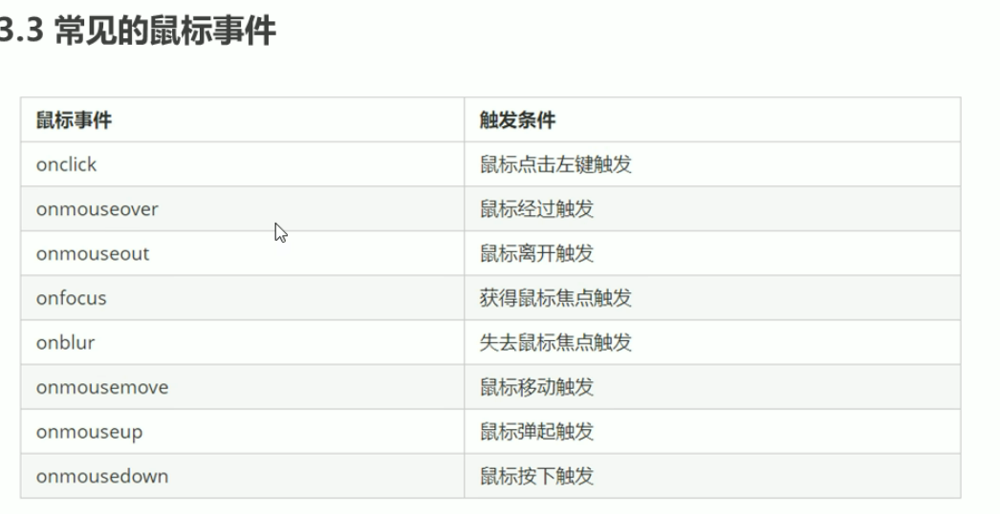
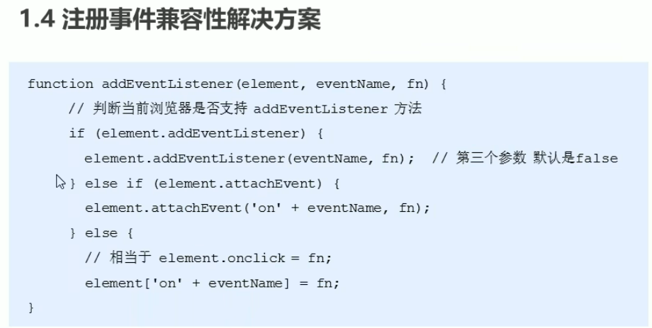
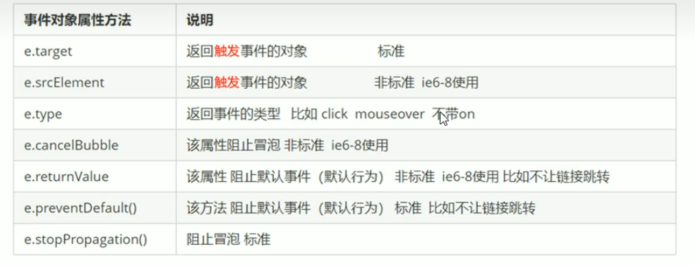
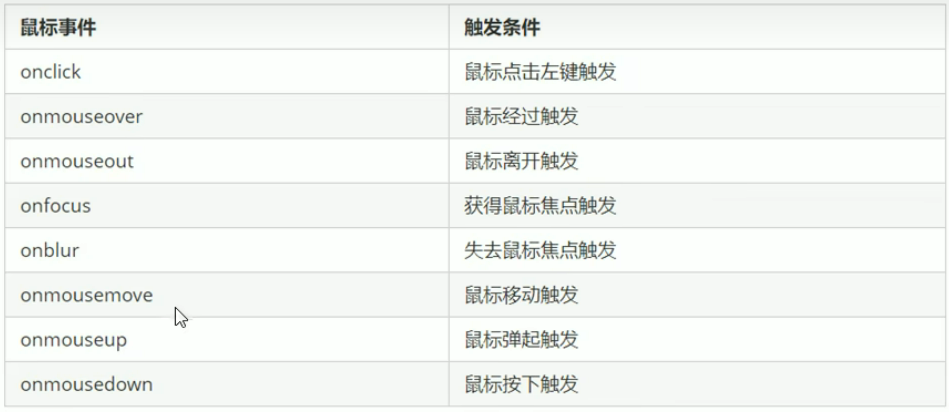
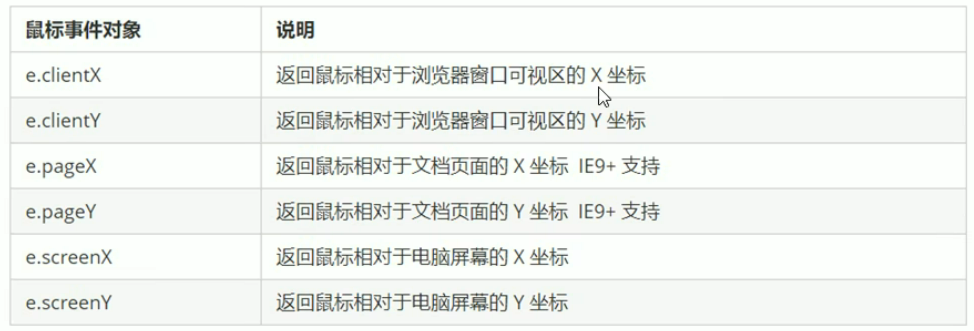

# Web APIs
## Web APIs与js的关联
js基础是ECMAScript（JavaScript语法）
Web APIs是W3C组织的标准，包括DOM(页面文档对象模型)和BOM(浏览器对象模型)，是js独有的部分
## API应用程序编程接口
给程序员提供的一种工具，以便能轻松地完成想要的功能（例如：插上充电接口就能实现冲死按功能
## Web API
浏览器提供的一套操作浏览器功能和页面元素的API(BOM和DOM)
# DOM
DOM是w3c组织推荐的处理可扩展标记语言的**标准编程接口**，可以改变网页的结构、内容、样式。

文档：一个页面就是一个文档，DOM中使用document表示
元素：页面中的所有标签都是元素, DOM中使用element表示
节点:网页中的所有内容都是节点(标签、属性、文本、注释等)，DOM中使用node示
**DOM把以上内容都看做是对象**
DOM在实际开发中主要用来操作元素
## 获取元素
### 根据ID获取
getElementById()
1. 文档从上往下加载，所以得先有标签，所以script直接写在下面
2. get获得 element 元素 by通过 id  驼峰命名法
3. 参数 id是大小写敏感的字符串
4. 返回的是一个元素对象
5. console.dir(timer);//打印我们返回的元素对象 更好的查看里面的属性和方法
```html
<div id='time'> time='2019-09-09'</div>
<script>
var timer=document.getElementById('time');
console.dor(timer)
</script>
```
### 根据标签名获取
getElementByTagName();返回带有指定标签名的对象的集合
1. 返回的是获取过来元素对象的集合 以伪数组的形式存储
```html
<ul>
        <li>巴拉拉能量，呜呼啦呼，小魔仙变身1</li>
        <li>巴拉拉能量，呜呼啦呼，小魔仙变身2</li>
        <li>巴拉拉能量，呜呼啦呼，小魔仙变身3</li>
        <li>巴拉拉能量，呜呼啦呼，小魔仙变身4</li>
        <li>巴拉拉能量，呜呼啦呼，小魔仙变身5</li>
    </ul>
    <script>
        var lis = document.getElementsByTagName('li');
        console.log(lis);
        console.log(lis[0]);
    </script>
```
2. 依次打印里面的元素可以采用遍历的方式
   **元素内容是动态的**
3. 如果页面中只有一个小li，返回的还是伪数组对的形式
4. 页面中没有元素返回的空的伪数组
5. 获取某个元素(父元素)内部所有指定标签名的子元素
**父元素必须是单个对象，必须指定是哪个对象.获取的时候不包括父元素自己**
```html
<ol>
        <li>生</li>
        <li>僻</li>
        <li>字</li>
    </ol>
    <script>
        var ol = document.getElementsByTagName('ol');
        console.log(ol[0].getElementsByTagName('li'));
        console.log(ol.getElementsByTagName('li'));//报错，必须指定某个具体的父元素对象
    </script>
```
```html
 <ol id="ol">
        <li>生</li>
        <li>僻</li>
        <li>字</li>
    </ol>
    <script>
        var lis = document.getElementsByTagName('li');
        console.log(lis);
        console.log(lis[0]);
        var ol = document.getElementById('ol');
        console.log(ol.getElementsByTagName('li'));
```
### H5获取元素方式
#### 通过类名获取
document.getElementsByClassName('类名');
```html
<div class="box">盒子1</div>
    <div class="box">盒子2</div>
    <div class="nav">
        <ul>
            <li>首页</li>
            <li>产品</li>
        </ul>
    </div>
    <script>
        var boxs = document.getElementsByClassName('box');
        console.log(boxs);
    </script>
```
#### 选择器获取元素
document.querySelector('选择器');根据指定选择器返回第一个元素对象
```html
    <div class="box">盒子1</div>
    <div class="box">盒子2</div>
    <div id="nav">
        <ul>
            <li>首页</li>
            <li>产品</li>
        </ul>
    </div>
    <script>
        var box = document.querySelector('.box');
        console.log(box);
        var nav = document.querySelector('#nav');
        console.log(nav);
        var li = document.querySelector('li');
        console.log();
    </script>
```
document.querySelectorAll();返回指定选择器的所有元素对象
### 获取特殊元素
#### 获取body元素
var bodyEle=document.body;
#### 获取html元素
var htmlEle=document.documentElement;
## 事件基础
点击一个按钮，弹出对话框
事件是有三部分组成 事件源 事件类型 事件处理程序 我们也称为事件三要素
(1)事件源事件被触发的对象谁按钮
var btn = document . getElementById( 'btn' );
(2) 事件类型
如何触发什么事件比如鼠标点击(onclick)还是鼠标经过还是键盘按下
(3)事件处理程序 通过一个函数赋值的方式完成
btn. onclick=function(){}
```html
        <button id="btn">唐伯虎</button>
        <script>
            var btn = document.getElementById('btn');
            btn.onclick = function() {
                alert('我是唐伯虎');
            }
        </script>
```
### 执行事件的步骤
1. 获取事件源
2. 注册事件(绑定事件)
3. 添加事件处理程序(采取函数赋值形式)
常见鼠标事件

## 操作元素内容
### 改变元素内容
• element.innerText();非标准
从起始位置到终止位置的内容,但它**去除html标签**，同时空**格和换行也会去掉**
• element.innerHTML();w3c标准
起始位置到终止位置的全部内容,**包括html标签,**同时**保留空格和换行**
**二者的区别**
```html
 <p></p>
        <script>
            var p = document.querySelector('p');
            // p.innerText = '今天是<strong>星期日</strong>';
            p.innerHTML = '今天是<strong>星期日</strong>';
        </script>
```
element.innerText不识别文本内部的html标签，而element.innerHTML可以识别
## 操作常见元素属性
标签名.元素属性   重新赋值即可覆盖
```html
  <style>
        img {
            width: 300px;
        }
    </style>

<div>
        <button id="zxy">张学友</button>
        <button id="ldh">刘德华</button>
    </div>
    

    <script>
        var ldh = document.getElementById('ldh');
        var zxy = document.getElementById('zxy');
        var img = document.querySelector('img');
        zxy.onclick = function() {
            img.src = './zxy.jpg';
            img.title = '张学友';
        }
        ldh.onclick = function() {
            img.src = 'ldh.jpg';
            img.title = '刘德华';
        }
    </script>
```
## 操作表单元素属性
表单里面的值是通过value修改的
type
value
checked
selected
disabled：禁用表单，不可被点击（button禁用）
获得元素对象btn.disabled=true;或者this.disabled=true; 可以达到同样效果
### 京东登录页面密码显示/隐藏
```html
<style>
        .box {
            position: relative;
            width: 400px;
            margin: 100px auto;
            border-bottom: 1px solid #ccc;
        }
        
        input {
            width: 370px;
            height: 37px;
            border: 0;
            outline: none;
        }
        
        .box img {
            position: absolute;
            right: 5px;
            top: 7px;
            width: 24px;
        }
    </style>

 <div class="box">
        <label for="">
        
        </label>
        <input type="password" id="pwd">
    </div>
    <script>
        var eye = document.querySelector('img');
        var pwd = document.querySelector('input');
        var flag = 0;
        eye.onclick = function() {
            if (flag == 1) {
                eye.src = './open.png';
                pwd.type = 'text';
                flag = 0;
            } else if (flag == 0) {
                eye.src = './close.png';
                pwd.type = 'password';
                flag = 1;
            }
        }
    </script>
```
## 操作元素样式属性
### element.style行内样式操作
1. 里面的样式采取驼峰命名法
2. JS修改style样式操作,产生的是行内样式, Css权重比较高
#### 循环精灵图
1. 给出的精灵图需要有排列规律
2. 利用for循环更改背景图位置，实现循环精灵图
#### 显示隐藏文本框内容
element.onfocus   得到焦点
element.onblur    失去焦点
### element.class类名样式操作
#### 使用className修改样式
element.className修改css样式
### className和style的区别
样式修改的较多就使用类名修改样式进行操作，className直接覆盖掉原来的类名
如果想要两个类都存在的话: div.className='first change';
### 密码框验证信息
1. 首先判断的事件是表单失去焦点onblur
2. 如果输入正确则提示正确的信息颜色为绿色小图标变化
3. 如果输入不是6到16位，则提示错误信息颜色为红色小图标变化
4. 因为里面变化样式较多，我们采取className修改样式
## 操作元素 排他思想
如果有同- -组元素,我们想要某一个元素实现某种样式 ,需要用到循环的排他思想算法:
1. 所有元素全部清除样式(干掉其他人)
2. 给当前元素设置样式( 留下我自己)
### 百度换肤
1. 获取元素
2. 循环注册事件
**注意赋值操作语句格式document.body.style.background = 'url(' + this.src + ')';**
### 表格隔行变色效果
1. 用到新的鼠标事件鼠标经过onmouseover鼠标离开onmouseout
2. 核心思路:鼠标经过tr行,当前的行变背景颜色，鼠标离开去掉当前的背景颜色
3. 注意:第一行( thead里面的行)不需要变换颜色,因此我们获取的是tbody里面的行
### 表单全选取消全选
循环语句绑定事件，恰当运用flag标志
## 自定义属性的操作
### 获取属性值
1. 元素.属性值 element.属性；主要获取内置属性值
2. element.getAttribute('属性') 主要用于获取自定义属性值；我们自己添加的属性自定义属性
### 设置属性值
1. element.属性=值
2. element.setAttribute('属性',值)，**这里面如果修改类名是class不是className**
### 移除属性
element.removeAttribute('属性');
### tab栏切换布局分析
**必备技能！！！**
两次使用排他思想且设置自定义属性index索引号
## H5自定义属性
自定义属性目的:是为了保存并使用数据。有些数据可以保存到页面中而不用保存到数据库中。
自定义属性获取是通过getAttribute( '属性')获取。但是有些自定义属性很容易引起歧义,不容易判断是元素的内置属性还是自定义属性。
### H5给我们新增了自定义属性:
1. 设置H5自定义属性
H5规定自定义属性data-开头做为属性名并且赋值。
比如<div data-index=“1" > </div>
或者使用js设置elenment.setAttribute('data-index',2);
2. 获取H5自定义属性
(1) 兼容性获取elenment.getAttribute('属性值');
(2) H5新增elenment.dataset.index或者elenment.dataset['index ']
(3)如果属性命名为data-list-name，获取时采用驼峰命名法 **ie11才支持**
elenment.dataset['listName']; 或者 elenment.dataset.listName;
## 节点操作
1. 利用DOM提供的方法获取元素 ，*逻辑型不强，繁琐*
2. 利用节点层次关系获取元素
一般情况下，节点有节点类型、节点名称、节点值三个基本属性
●元素节点nodeType为1
●属性节点nodeType为2
●文本节点nodeType为3 (文本节点包含文字、空格、换行等)
**主要操作元素节点**
### 节点层次
1. 获取父节点parentNode，就近原则，找不到父节点返回为空
2. 子节点childNodes包含所有的节点，包括元素节点、文本节点等；获取元素的子元素节点children
第一个孩子：firstChild,最后一个孩子：lastChild,第一个子节点无论是第一个文本节点还是第一个元素节点
如果想获取第一个元素子节点firstElenmentChild,**仅限于ie9以上**
或者使用元素伪数组来表示children[0];
元素长度不确定的时候可以使用ol.children[ol.children.length-1];来表示
3. 兄弟节点 nextSiBling:得到的是下一个兄弟节点 包括元素节点和文本节点
nextElenmentSiBling:得到的是下一个兄弟元素节点
上一个兄弟节点：previousSiBling(包括兄弟文本节点和兄弟元素节点)
**以上两个方法有兼容性问题，IE9以上才支持**
### 创建节点
1. 创建节点元素节点
document.creatElenment('tagName')
例如：var li=document.creatElenment.('li');
2. 添加节点
node.appendChild(child)将一个节点添加到指定父节点的子节点的列表末尾类似于css后面的after
例如：var ul=document.querySelector('ul');
ul.appendChild(li);
3. 在指定元素前添加节点
node.insertBefore(child,元素);
例如: var lili=document.creatElenment('li');
ul.insertBefore(lili,ul.children[0]);
4. 删除节点
node.removeChild(child)删除一个子结点,返回删除的节点    
组织链接跳转javascriot:;或者javascript:void(0); 
5. 复制节点
浅拷贝:只复制节点,不复制节点里面的内容node.cloneNode();
括号里面为空或者false,则会自动默认浅拷贝
深度拷贝:复制节点以及里面的内容node.cloneNode(true);
然后再添加节点
例如:
var li=document.querySelectorAll('li');
var lili = li.children[0].cloneNode(true);
ul.appendchild(lili);
 ### 动态生成表格(极其重要)
## 三种动态创建元素区别
1. document.write();创建元素 如果页面文档流加载完毕,再调用这句话会导致页面重绘
2. innerHTML='';将内容写入某个DOM节点,不会导致页面重绘;创建多个元素效率更高(采取数组形式拼接),结构稍微复杂
3. creatElenment('');效率稍微低一点,但是结构更清晰
**不管在什么情境下,innerHTML的效率要比creatElement效率高**
```html
var arr=[];
for(var i=0;i<1000;i++){
    arr.push('<div style="width:100px;height:2px;border:1px solid pink;"></div>')
}
document.body.innerHTML=arr.join('');
```
# DOM重点核心
文档对象模型( Document Object Model ,简称DOM) ,是W3C组织推荐的处理可扩展标记语言( HTML或者XML )的标准编程接口。
W3C已经定义了一系列的DOM接口,通过这些DOM接口可以改变网页的内容、结构和样式。
1. 对于JavaScript ,为了能够使JavaScript操作HTML , JavaScript就有了一套自 己的dom编程接口。
2. 对于HTML , dom使得htm|形成一棵dom树. 包含文档、元素、节点
关于dom操作,我们主要针对于元素的操作。主要有创建、增、删、改、查、属性操作、事件操作。
## 修改元素
主要修改dom的元素属性, dom元素的内容、属性,表单的值等
1. 修改元素属性: srC、 href. title等
2. 修改普通元素内容: innerHTML 、innerText
3. 修改表单元素: value、type、 disabled等上
4. 修改元素样式: style、 className
### 查询元素
1. DOM提供的API方法 : getElementByld、 getElementsByTagName 古老用法不太推荐
2. H5提供的新方法: querySelector、 querySelectorAll 提倡
3. 利用节点操作获取元素:父(parentNode)、 子(children)、 兄(previousElementSibling、nextElementSibling)提倡
### 属性操作
主要针对于自定义属性。
1. setAttribute :设置dom的属性值
2. getAttribute :得到dom的属性值
3. removeAttribute移除属性
### 事件操作
给元素注册事件,采取事件源事件类型=事件处理程序
# 事件高级
## 注册事件(事件绑定)
### 传统注册事件
● 利用on开头的事件
● 特点:注册事件的唯一性
● 同一个元素同一个事件只能有一个处理函数,最后注册的处理函数将会覆盖前面注册的处理函数
### 方法监听注册方式
● w3c 标准推荐方式
● addEventListener(它是一个方法)
● IE9.之前的IE不支持此方法,可使用attachEvent()代替
● 特点:同一个元素同一个事件可以注册多个监听器
eventTarget . addEventListener (type, listener [,useCapture] )
eventTarget . addEventListener ()方法将指定的监听器注册到eventTarget (目标对象)上,当该对象触发指定的事件时,就会执行事件处理函数。
该方法接收三个参数:
● type :事件类型字符串,比如click、 mouseover ,注意这里不要带on
● listener :事件处理函数,事件发生时,会调用该监听函数
● useCapture :可选参数,是一个布尔值,默认是false。
例如:
```html
btns[1].addEventListener('click', function() {
            alert('ni you 被监听啦!');
        })
        btns[1].addEventListener('click', function() {
            alert('ni you 被监听啦22333!');
```
**里面的事件类型是字符串,必须加引号且不带on;同一个元素同一个事件可以多个事件监听器(事件处理程序)**
**attachEvent()**
解决兼容问题
## 删除事件(解绑事件)
1. 传统方式解绑事件elenment.onclick=null;
2. ①eventTarget. removeEventListener (type，listener [，useCapture]) ;
②eventTarget. detachEvent (eventNameWithon, callback) ;
```html
 var divs = document.querySelectorAll('div');
        divs[0].addEventListener('click', f1);

        function f1() {
            alert('111');
            divs[0].removeEventListener('click', f1);
        }
        divs[1].attachEvent('onclick', f2);

        function f2() {
            alert('222');
            divs[1].detachEvent('onclick', f2);
        }
```
## DOM事件流理论
事件流描述的是从页面中接收事件的顺序。
事件发生时会在元素节点之间按照特定的顺序传播,这个传播过程即DOM事件流。
分为三个阶段:
1. 捕获阶段
事件捕获:网景最早提出,由DOM最顶层节点开始,然后逐级向下传播到到最具体的元素接收的过程。
2. 当前目标阶段
3. 冒泡阶段
事件冒泡:IE 最早提出,事件开始时由最具体的元素接收,然后逐级向上传播到到DOM最顶层节点的过程。
**注意:**
1. js只能执行捕获或者冒泡的其中一个阶段
2. onclick和attachEvent只能得到冒泡阶段
3. addEventlistener (type, listener [, useCapture])第三个参数如果是true ,表示在事件捕获阶段调用事件处理程序;如果是false (不写默认就是false ) , 表示在事件冒泡阶段调用事件处理程序。
4. 在我们的程序中,我们更关注事件冒泡,很少关注事件捕获
5. 有些事件是没有冒泡的,比如onblur、onfocus、 onmouseenter. onmouseleave 
## 事件对象
1. event就是一个事件对象写到我们侦听函数的小括号里面当形参来看
2. 事件对象只有有了事件才会存在，它是系统给我们自动创建的，不需要我们传递参数
3. 事件对象是我们事件的一系列相关数据的集合跟事件相关的比如鼠标点击里面就包含了鼠标的相关信息，鼠标坐标啊，如果是键盘事件里面就包含的键盘事件的信息比如判断用户按下了那个键
4. 这个事件对象我们可以自己命名比如event、evt、e
5. 有兼容性问题ie678需要使用window.event才可以  e=e||window.event;
### 事件对象的常见属性和方法

e.target返回的是触发事件对象 this指向的是绑定事件对象
通俗的区别:哪个元素被点击就返回哪个元素,哪个元素绑定了事件就返回哪个元素
### 阻止默认行为
e.preventDefault();  dom标准写法
传统注册方式:
//普通浏览器e. preventDefault(); 方法
e. preventDefault();
//低版本浏览器ie678  returnValue  属性
// e. returnValue;
我们可以利用return false 也能阻止默认行为没有兼容性问题特点: 
return false;   return后面的代码不执行了
alert(11);
### 阻止冒泡事件
事件冒泡:开始时由最具体的元素接收,然后逐级向上传播到到DOM最顶层节点。
1. W3C标准写法:e.stopPropagation()方法
2. e.cancelBubble=true;
### 事件委托(代理  委派)
**不是每个子节点单独设置事件监听器,而是事件监听器设置在其父节点上,然后利用冒泡原理影响设置每个子节点。**
以上案例:给ul注册点击事件,然后利用事件对象的target找到当前击的li ,因为点击li,事件会冒泡到ul上,ul有注册事件,就会触发事件监听器。
#### 事件委托的作用
我们只操作了一次DOM , 提高了程序的性能。
给父节点添加监听,利用事件冒泡影响每一个子节点
## 常用的鼠标事件

1. 禁止鼠标右键contextmenu 主要用于程序员取消默认的上下文菜单
2. 禁止鼠标选中 selectstart
## 鼠标的事件对象
event对象代表事件的状态,跟事件相关的一系列信息的集合。现阶段我们主要是用鼠标事件对象MouseEvent和键盘事件对象KeyboardEvent

e.clientX和e.clientY显示的是鼠标在可视区的x和y坐标
e.pageX和e.pageY 在网页页面的横纵坐标
### 跟随鼠标的天使
mousemove
## 常用的键盘事件
onkeyup键盘弹起的时候触发
onkeydown键盘按下时触发
onkeypress键盘按下时触发，但是不识别功能键 比如shift ctrl 箭头等
**三个事件的执行顺序**：onkeydown onkeypress onkeyup
### 键盘事件对象
keycode返回键盘的ASCII值
keyup和keydown不区分字母大小写，keypress区分  **经常使用up down，用keycode返回区分大小写**
#### 京东搜索框
不使用keydown和keypress的原因：按下即触发，文本框内容延迟一位到放大文本框中