# BOM概述
BOM ( Browser Object Model )即浏览器对象模型,它提供了独立于内容而与浏览器窗口进行交互的对象,其核心对象是window。
BOM缺乏标准, JavaScript语法的标准化组织是ECMA , DOM的标准化组织是W3C , BOM最初是Netscape浏览器标准的一部分。
## DOM和BOM的区别
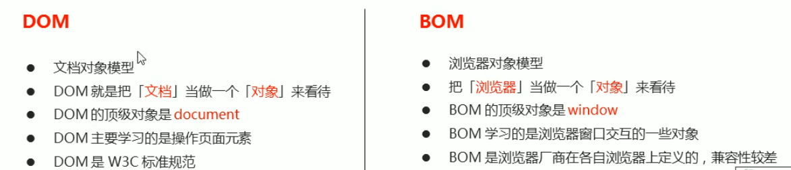
## BOm的构成
window对象是浏览器的顶级对象,它具有双重角色。
1. 它是JS访问浏览器窗口的一一个接口。
2. 它是一个全局对象。义在全局作用域中的变量、函数都会变成window对象的属性和方法。
在调用的时候可以省略window ,前面学习的对话框都属于window对象方法,如alert0、prompt0等。
*window下的一个特殊属性，window.name*

# window对象的常见事件
## 窗口加载事件
window.onload = function() {}或者window. addEventListener ("load" , function() {}) ;
window.onload是窗口页面)加载事件当文档内容完全加载完成会触发该事件(包括图像、脚本文件、CSS文件等),就调用的处理函数。
**注意:**
1. 有了window.onload就可以把JS代码写到页面元素的上方,因为onload是等页面内容全部加载完毕,
再去执行处理函数。
2. window.onload传统注册事件方式只能写一次,如果有多个,会以最后一个window.onload为准。
DomContentLoaded页面先加载，DOM主要标签加载完毕，不包含图片，flash,CSS等，加载速度要比load快一点
加载结束了才是load，load等页面事件全部加载完毕
## 调整窗口大小事件
window. onresize = function() { }
window. addEventListener ("resize", function() {});
window. onresize是调整窗口大小加载事件，当触发时就调用的处理函数。
**注意:**
1. 只要窗口大小发生像素变化,就会触发这个事件。
2. 我们经常利用这个事件完成响应式布局。window.innerWidth 当前屏幕的宽度 
# 定时器
## 两种定时器
### setTimeout()定时器
window.setTimeout (调用函数，[延迟的毫秒数]) ;
setTimeout()方法用于设置一个定时器,该定时器在定时器到期后执行调用函数。
**注意:**
1. window可以省略。
2. 这个调用函数可以直接写函数,或者写函数名或者采取字符串'函数名0’三种形式。 第三种不推荐
3. 定时器时间单位是毫秒
该函数是回调函数，需要等待时间，时间到了才会执行该函数，onclick也是回调函数
#### 停止定时器 setTimeout
window.clearTimeout(timeoutID)
**注意:**
1. window可以省略。
2. 里面的参数就是定时器的标识符。
### setInterval()定时器
window . setInterval (回调函数，[间隔的毫秒数]);
setInterval()方法重复调用一个函数,每隔这个时间,就去调用一次回调函数。
#### 停止计时器 clearInterval
clearInterval(timeoutID);
## 京东倒计时制作
```html
 var hour = document.querySelector('.hour');
        var minute = document.querySelector('.minute');
        var second = document.querySelector('.second');
        var inputTime = +new Date('2022-08-09 24:00:00');
        countDown();
        setInterval(countDown, 1000);

        function countDown(time) {
            var nowTime = +new Date();
            var times = (inputTime - nowTime) / 1000;
            var h = parseInt(times / 60 / 60 % 24);
            h = h > 10 ? h : '0' + h;
            hour.innerHTML = h;
            var m = parseInt(times / 60 % 60);
            m = m > 10 ? m : '0' + m;
            minute.innerHTML = m;
            var s = parseInt(times % 60);
            s = s > 10 ? s : '0' + s;
            second.innerHTML = s;
        }
```
## 发送短信案例
```html
var timecount = setInterval(function() {

                if (time == 0) {
                    clearInterval(timecount);
                    btn.disabled = false;
                    btn.innerHTML = '发送';
                    time = 2;
                } else {
                    btn.innerHTML = '还剩' + time + '秒';
                    time--;
                }
            }, 1000);
```
## this的指向问题
this的指向在函数定义的时候是确定不了的,只有函数执行的时候才能确定this到底指向谁,一般情况下this的最终指向的是那个调用它的对象
1. 全局作用域或者普通函数中this指向全局对象window(注意定时器里面的this指向window)
2. 方法调用中谁调用this指向谁
3. 构造函数中this指向构造函数的实例  
function Fun() {
console.log(this); // this 指向的是fun实例对象
}
var fun = new Fun();
# JS执行机制
## js是单线程
同步：单线程，一次只能做一件事，
异步：一次可以同时做多件事，回调函数属于异步任务，异步任务包括三类①click，resize等普通事件，②资源加载，如load，error等③定时器setInterval、setTimeout等 
异步任务放在任务队列里面(或者称为消息队列)，先执行同步任务，在执行异步任务
由于主线程不断的重复获得任务、执行任务、再获取任务、再执行,所以这种机制被称为事件循环( eventloop )。
！[](2.png)
**本质区别：**在流水线上的各个流程的执行顺序不同
# location对象
## URL
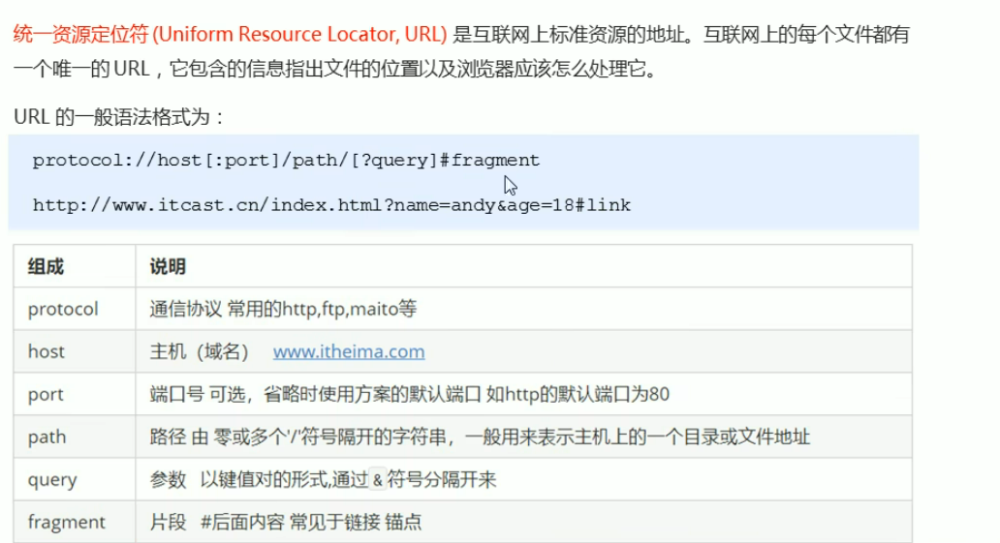
## location对象属性
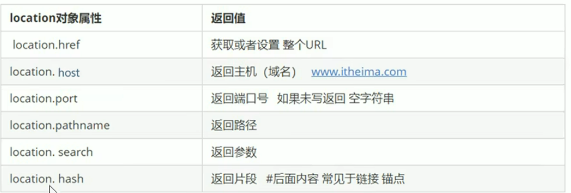
**重点记href和search**
### 5秒钟之后自动跳转页面
核心：定时器setInteval(函数,秒数)  利用location.href重新赋值进行页面跳转  
### 获取url参数(不同页面之间的数据传输)
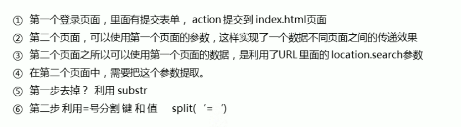
## location对象的方法
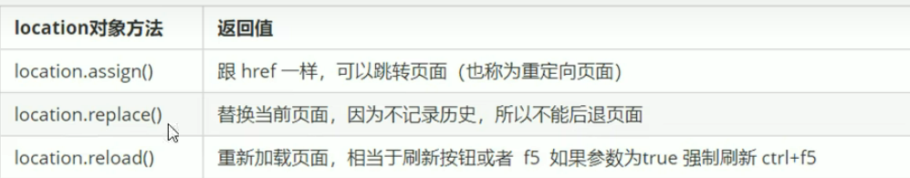
# navigator对象
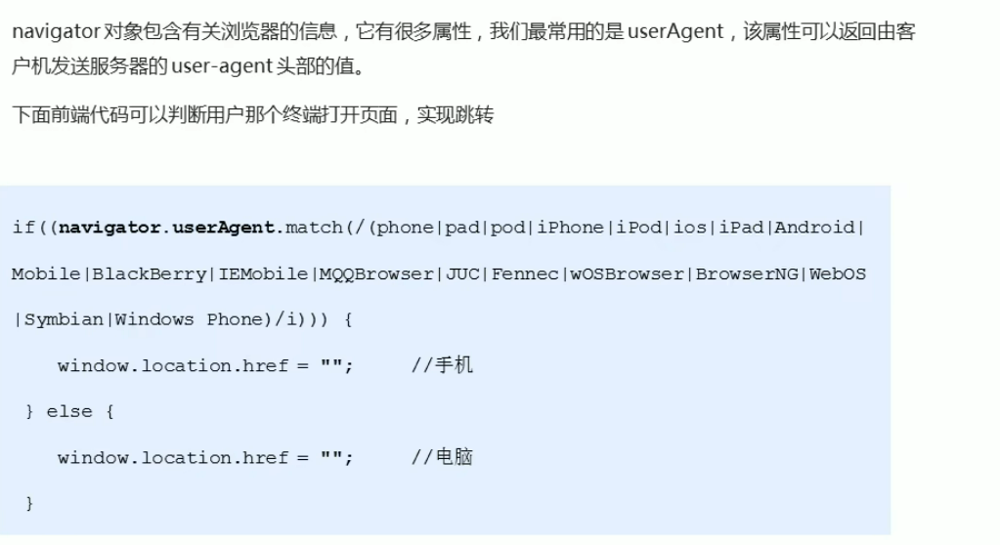
# history对象
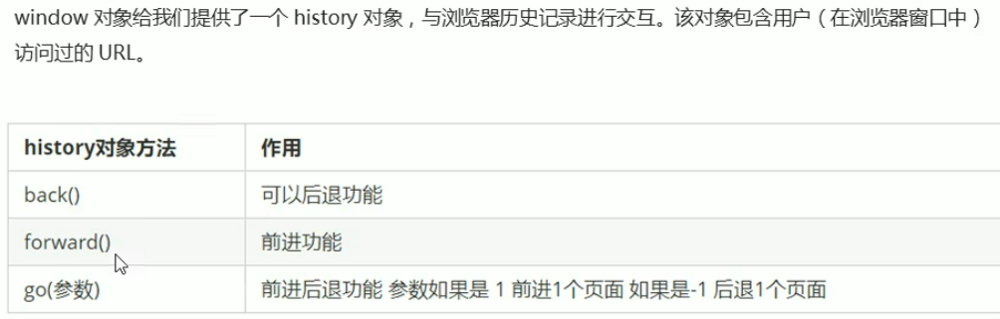
# PC端网页特效
## 元素偏移量offset系列
动态获得元素位置、大小
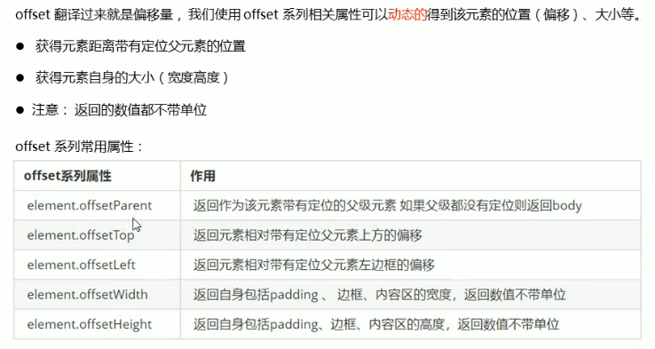
offsetLeft或者offsetTop的父元素没有定位或者没有父元素，则以body为准
offsetWidth和offsetHeight包含padding+border+width
offsetParent返回的是带定位的父亲，否则返回body
**与parentNode区别：**
parentNode返回的是亲爸爸不管有没有定位，而offsetParent返回的是有定位的父亲，冒泡式向上查找，没有的话就返回body

**offset与style的区别**
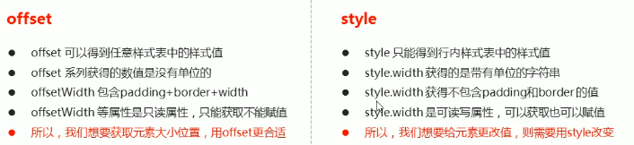
**记住最后一句！很重要**
**offsetLeft等offset系列，不设置定位不会实现该设置功能**
### 模态框拖拽
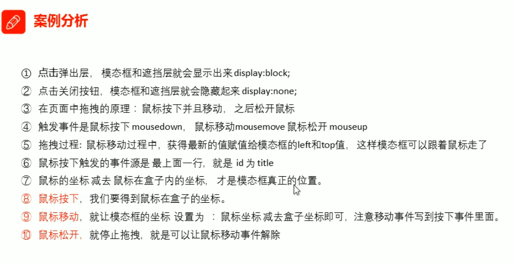
### 京东放大镜
**自己写一遍，尚未完成**
## 元素可视区client系列
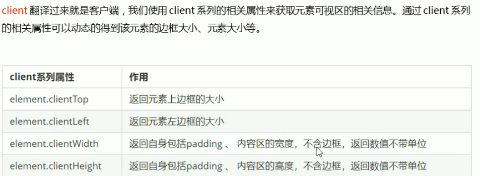
## 立即执行函数
不用调用，可以直接执行
(function() {})()或者 (function(){}());
里面的所有变量都是局部变量，不会命名冲突
### 淘宝flexible.js源码分析
window.devicePicelRatio  页面像素比
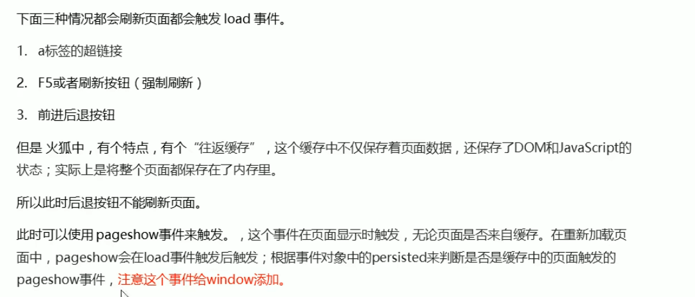
flexible.js文件里面常看，需要知道每个模块功能
## 元素滚动scroll系列
### 元素scroll系列属性
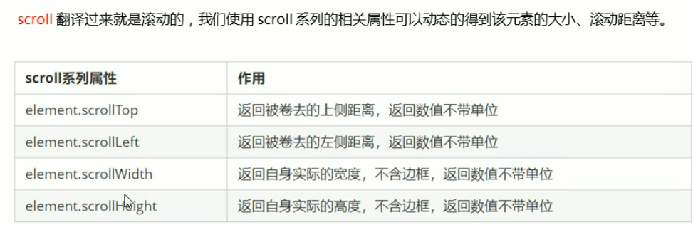
### 仿淘宝固定右侧侧边栏
1. 原先侧边栏是绝对定位
2. 当页面滚动到一定位置,侧边栏改为固定定位
3. 页面继续滚动,会让返回顶部显示出来
① 需要用到页面滚动事件scroll因为是页面滚动,所以事件源是document
② 滚动到某个位置,就是判断页面被卷去的上部值。
③ 页面被卷去的头部:可以通过window.pqgeYOffset获得如果是被卷去的左侧window.pageXOffset
④ 注意,元素被卷去的头部是element.scrollTop , 如果是页面被卷去的头部则是window.pageYOffset
window.pageYOffset  页面被卷去的头部
### 兼容性问题
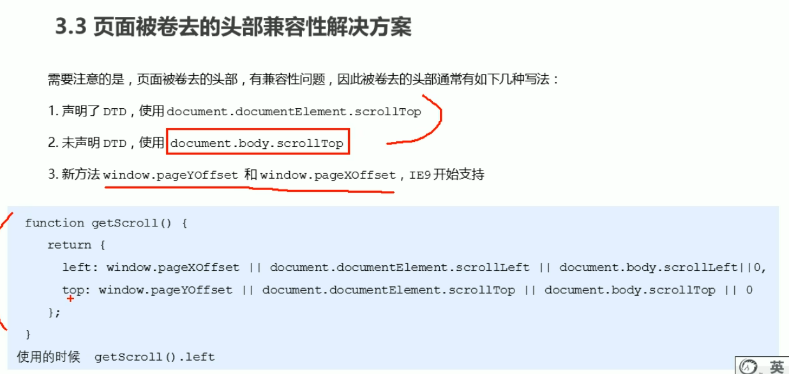
## 三大系列区别与使用
1. element.offsetWidth:返回自身包括padding、边框、内容区的宽度，返回数值不带单位
2. element.clientWidth:返回自身包括padding、内容区的宽度，不含边框，返回数值不带单位
3. element.scrollWidth:返回自身实际的宽度，不含边框，返回数值不带单位（内容宽度全部显示）
** 主要用法：**
offsetLeft offsetTop常用于获取元素位置
clientWidth cliendHeight用于获取元素大小
scrollTop scrollLeft 用于获取滚动距离
## 动画封装函数
//动画原理
1. 获得盒子当前位置
2. 让盒子在当前位置加上1个移动距离
3. 利用定时器不断重复这个操作
4. 加一个结束定时器的条件
5. 注意此元素需要添加定位，才能使用element.style.left 
### 动画函数简单封装

```html 
//简单动画函数封装obj目标对象 target 目标位置
function animate(obj, target) {}
//当我们不断的点击按钮，这个元素的速度会越来越快，因为开启了太多的定时器
//解决方案就是让我们元素只有一个定时器执行
//先清除以前的定时器， 只保留当前的一个定时器执行
clearInterval(obj.timer);
obj.timer = setInterval(function() {
if (obj.offsetLeft >= target) {
//停止动画本质是停止定时器
clearInterval(obj.timer); I
obj.style.left = obj. offsetLeft + 1 + 'px';
}, 30);
```
### 缓动动画原理
思路:
1. 让盒子每次移动的距离慢慢变小,速度就会慢慢落下来。
2. 核心算法: (目标值-现在的位置) / 10做为每次移动的距离步长
3. 停止的条件是 :让当前盒子位置等于目标位置就停止定时器
```html
function animate(obj, target) {
            clearInterval(obj.timer);
            obj.timer = setInterval(function() {
                var step = (target - obj.offsetLeft) / 10;
                if (obj.offsetLeft >= target) {
                    clearInterval(obj.timer);
                }
                // 匀速动画加固定值
                // 变速动画加变化值 步长公式：
                // step=(目标位置-现在位置)/10，
                // 数值将一直变化，越来越小，实现缓动动画
                obj.style.left = obj.offsetLeft + step + 'px';
                console.log(11);
            }, 100);

        }
```
**实际最后位置没有在目标位置。需要对步长公式取整，不能倒退，应用向上取整函数**
### 给动画函数添加回调函数
函数作为参数。当本函数处理结束后，再调用参数函数进行，这个过程就叫回调
**回调函数写在定时器结束的位置**
### 动画函数的使用 
封装到js文件中，随用随取，大大减少工作重复量
### 轮播图效果
1. 鼠标经过轮播图模块,左右按钮显示,离开隐藏左右按钮。
2. 点击右侧按钮一次,图片往左播放-张,以此类推,左侧按钮同理。
3. 图片播放的同时，下面小圆圈模块跟随一变化。
4. 点击小圆圈,可以播放相应图片。
5. 鼠标不经过轮播图,轮播图也会自动播放图片。
6. 鼠标经过,轮播图模块，自动播放停止。
#### 无缝滚动
① 点击右侧按钮一次，就让图片滚动一张。
② 声明一个变量num，点击一 次，自增1，让这个变量乘以图片宽度，就是ul的滚动距离。
③ 图片无缝滚动原理
④ 把ul第一个li复制- 份，放到ul 的最后面
⑤ 当图片滚动到克隆的最后一张图片时，让ul 快速的、不做动画的跳到最左侧: left 为0
⑥ 同时num赋值为0，可以从新开始滚动图片了
考虑到ol中的li也会多一个，导致四张图片有五个圆点，所以考虑js帮助克隆图片
**解决办法**
深克隆：cloneNode(true)
浅克隆：空值或者false
#### 小圆点随着右侧箭头进行变化
设置变量num和circle
#### 轮播图也会自动播放
**关键点:**手动调用事件  arrow_r.click();
## 常见网页特效案例
### 节流阀
防止轮播图按钮点击连续过快导致播放过快  
**节流阀目的:**当上一个函数动画内容执行完毕,再去执行下一个函数动画,让事件无法连续触发。
**核心实现思路:**利用回调函数,添加一个量来控制,锁住函数和解锁函数。
开始设置一个变量var flag= true;
lf(flag) {flag= false; do something}   关闭水龙头
利用回调函数动画执行完毕, flag=true 打开水龙头
callback && callback 左侧为真执行右侧，左侧为假，直接断点，不继续执行
### 返回顶部案例
滚动窗口至文档中的特定位置。
window.scroll(x,y)  //xy不跟单位
①带有动画的返回顶部
②此时可以继续使用我们封装的动画函数
③只需要把所有的left 相关的值改为跟页面垂直滚动距离相关就可以了
④页面滚动了多少,可以通过window.pageYOffset得到
⑤最后是页面滚动,使用window.scroll(x,y)
### 筋斗云效果
鼠标经过某个小li，筋斗云跟这到当前小i位置
鼠标离开这个小i，筋斗云复原为原来的位置
鼠标点击了某个小li，筋斗云就会留在点击这个小li的位置
## 移动端网页特效
### 触屏事件 touch（也称触摸事件）
touch对象代表-个触摸点。 触摸点可能是一根手指,也可能是一根触摸笔。 触屏事件可响应用户手指(或触控笔)对屏幕或者触控板操作。
常见的触屏事件如下:
|触屏touch事件|说明|
|---|---|
|touchstart|手指触摸到一个DOM元素时触发|
|touchmove|手指在一个DOM元素上滑动时触发|
|touchend|手指从一个DOM元素上移开时触发|
#### 触摸事件对象 TouchEvent
TouchEvent是一类描述手指在触摸平面 (触摸屏、触摸板等)的状态变化的事件。这类事件用于描述一个或多个触点,使开发者可以检测触点的移动,触点的增加和减少, 等等
|触摸列表|说明|
|---|---|
|touches|正在触摸屏幕的所有手指的一个列表|
|**targetTouches**|正在触摸当前DOM元素上的手指的一个列表|
|changedTouches|手指状态发生了改变的列表，从无到有，从有到无变化|
#### 移动端拖动元素
1. touchstart、touchmove、 touchend 可以实现拖动元素
2. 但是拖动元素需要当前手指的坐标值我们可以使用targetTouches[0]里面的pageX和pageY
3. 移动端拖动的原理:手指移动中 ,计算出手指移动的距离。然后盒子原来的位置+手指移动的距离
4. 手指移动的距离:手指滑动中的位置 减去手指刚开始触摸的位置
**拖动元素三步曲:**
(1 )触摸元素touchstart :获取手指初始坐标,同时获得盒子原来的位置
(2)移动手指touchmove :计算手指的滑动距离,并且移动盒子
(3)离开手指touchend:
*注意:手指移动也会触发滚动屏幕所以这里要阻止默认的屏幕滚动e.    preventDefault0;*
使移动具有动画效果缓慢移动，使用以下语句
        ul.style.transition = 'all .3s';
#### 无缝滚动
```html
 var timer = setInterval(() => {
        index++;
        var transformx = -index * focusWidth;
        ul.style.transition = 'all .3s';
        ul.style.transform = 'translateX(' + transformx + 'px)';
    }, 2000);
    ul.addEventListener('transitionend', function() {
        if (index == 3) {
            index = 0;
            ul.style.transition = 'none';
            var transformx = -index * focusWidth;
            ul.style.transform = 'translateX(' + transformx + 'px)';
        }
    })
```
**监听过度完成**transitionend
### 移动端常见特效
#### classList属性
返回元素类名，ie10以上才可以实现
该属性用于在元素中添加,移除及切换CSS类。有以下方法
添加类:
element.classList.add('名’) ;
移除类:
element.classList.remove('类名’);
切换类：（有就删除，没有就添加）
document.body.classList.toggle('bg' )
#### 回弹模块
```html
 ul.addEventListener('touchend', function(e) {
        if (Math.abs(moveX) > 50) {
            if (moveX > 0) {
                index--;
            } else {
                index++;
            }
            var transformx = -index * focusWidth;
            ul.style.transition = 'all .3s';
            ul.style.transform = 'translateX(' + transformx + 'px)';

        } else {
            var transformx = -index * focusWidth;
            ul.style.transition = 'all .3s';
            ul.style.transform = 'translateX(' + transformx + 'px)';
        }
    });
```
#### 返回顶部
web端适用于移动端
#### click延时解决方案
移动端click事件会有300ms的延时,原因是移动端屏幕双击会缩放(double tap to zoom)页面。
**解决方案:**
1. 禁用缩放。浏览器禁用默认的双击缩放行为并且去掉300ms的点击延迟。
<meta name="viewport" content="user-scalable=no">
2. 利用touch事件自己封装这个事件解决300ms延迟。
原理就是:
1.当我们手指触摸屏幕,记录当前触摸时间
2.当我们手指离开屏幕,用离开的时间减去触摸的时间
3.如果时间小于150ms ,并且没有滑动过屏幕，那么我们就定义为点击
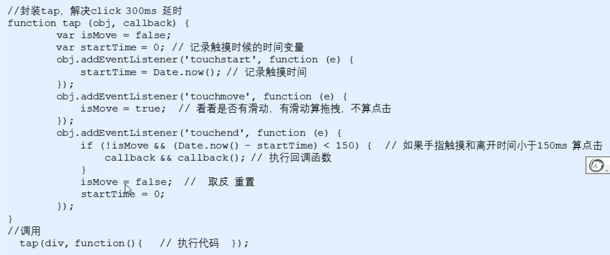
3. 使用常见插件fastclick.js实现
### 移动端常见插件
#### fastclick插件使用
移动端要求的是快速开发,所以我们经常会借助于一些插件来帮我完成操作 ,那么什么是插件呢?
JS插件是js文件,它遵循-定规范编写,方便程序展示效果,拥有特定功能且方便调用。如轮播图和瀑布流插件。
特点:它一般是为了解决某个问题而专门存在,其功能单一,并且比较小。我们以前写的animate.js也算一个最简单的插件
fastclick插件解决300ms延迟。使用延时
GitHub官网地址: https://github.com/ftlabs/fastclick
#### swiper插件的使用
https://www.swiper.com.cn 中文网
引入插件相关文件，按照语法规定使用 
**参数修改**
1. 在js中修改，可以看swiper API来查找属性
2. 在css中修改，直接在写一个进行覆盖，增加权重  !important
#### 其他移动端常见插件
●superslide : http://www.superslide2.com/
●iscroll : https://github.com/cubiq/iscroll
**使用方法：**
1. 确认插件实现的功能
2. 去官网查看使用说明
3. 下载插件
4. 打开demo实例文件,查看需要引入的相关文件,并且引入
5. 复制demo实例文件中的结构html ,样式Ccss以及js代码
#### 视频插件 zy.media.js
H5给我们提供了video标签,但是浏览器的支持情况不同。
不同的视频格式文件,我们可以通过source解决。
但是外观样式,还有暂停,播放,全屏等功能我们只能自己写代码解决。
这个时候我们可以使用插件方式来制作。

### 移动端常用开发框架
插件实现功能单一不全面，而框架封装的功能较为全面
#### bootstrap.js使用
1. 引入相关js文件
2. 复制HTML 结构
3. 修改对应样式
4. 修改相应JS参数
# 本地存储
本地存储特性
1. 数据存储在用户浏览器中
2. 设置、读取方便甚至页面刷新不失数据
3. 容量较大, sessionStorage约5M、localStorage约20M
4. 只能存储字符串,可以将对象JSON.stringify0编码后存储

## sessionStorage
1. 生命周期为关闭浏览器窗口
2. 在同一个窗口(页面)下数据可以共享
3. 以键值对的形式存储使用
存储数据:
sessionStorage.setltem(key, value)
获取数据:
sessionStorage.getltem(key)
删除数据:
sessionStorage.removeltem(key)
清除所有数据:
sessionStorage.clear();

## localStorage
1. 生命周期永久生效,除非手动删除否则关闭预面也会存在
2. 可以多窗口(页面)共享(同一浏览器可以共享)
3. 以键值对的形式存储使用
存储数据:
localStorage.setltem(key, value)
获取数据:
localStorage.getltem(key)
删除数据:
localStorage.removeltem(key)
清除所有数据:
localStorage.clear();
**localStorage和sessionStorage区别**
sessionStorage只能在同一个页面中进行调用
localStorage在一个浏览器不同页面中均可调用，浏览器关闭也不会删除
### 记住用户名案例
