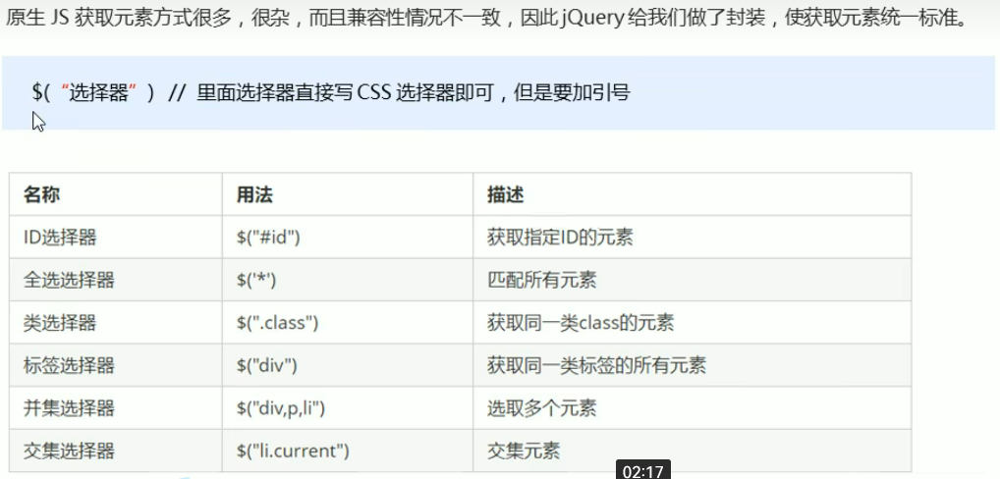
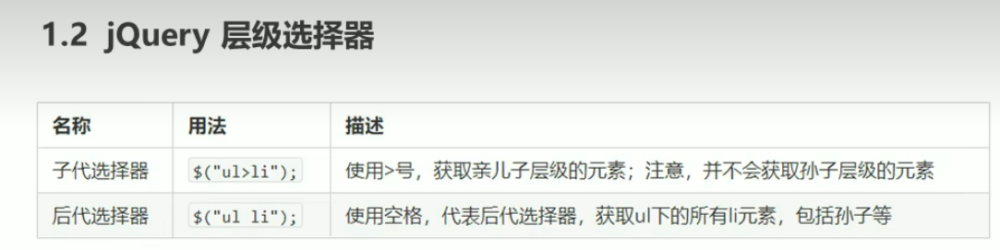
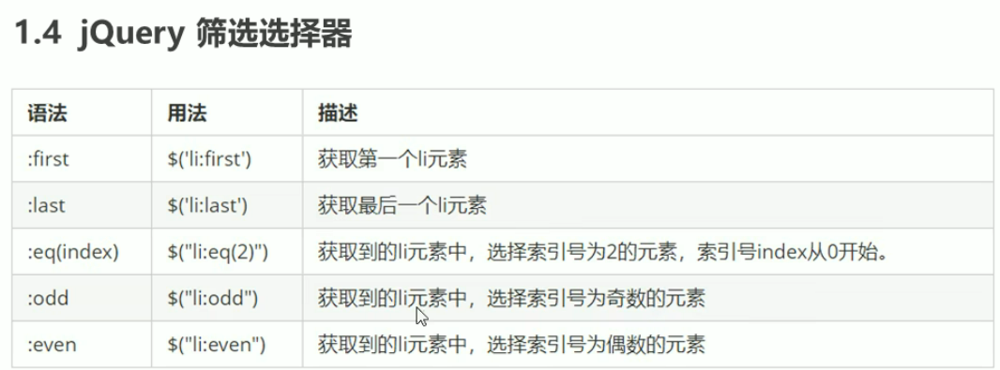
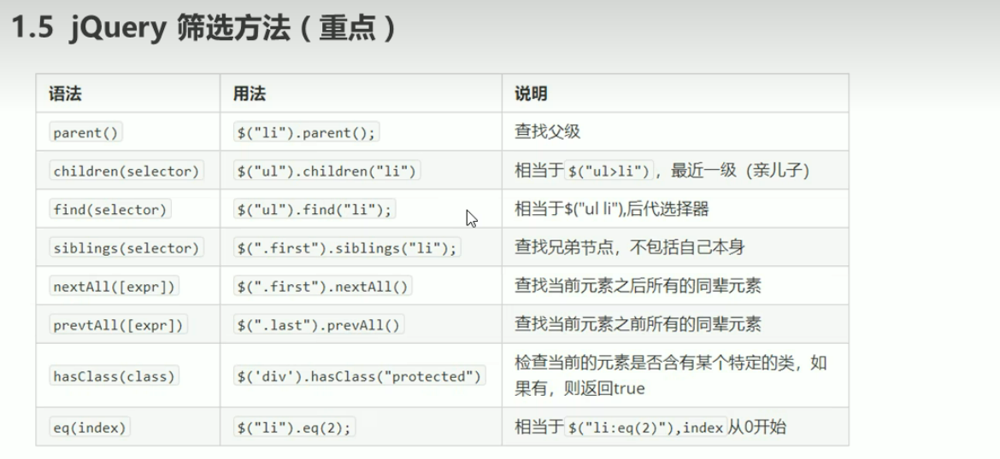
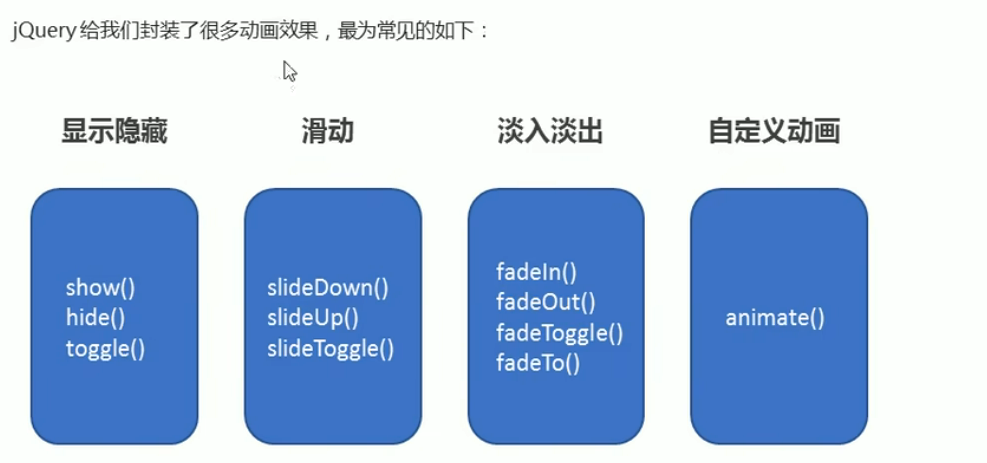
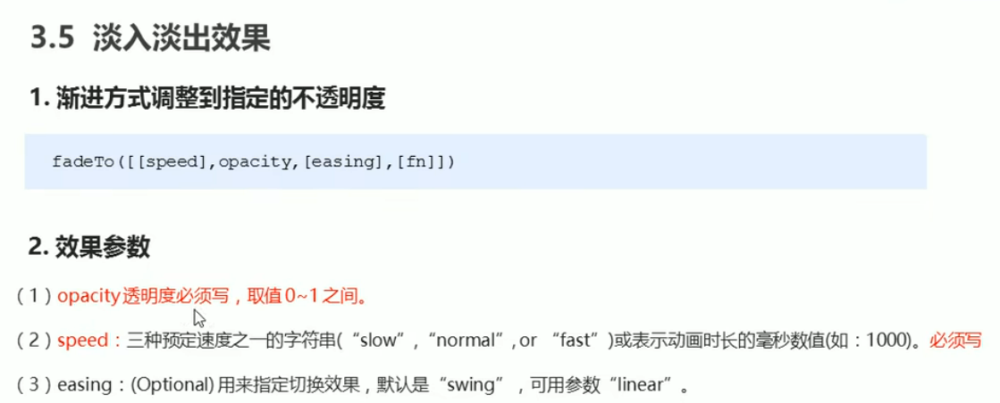
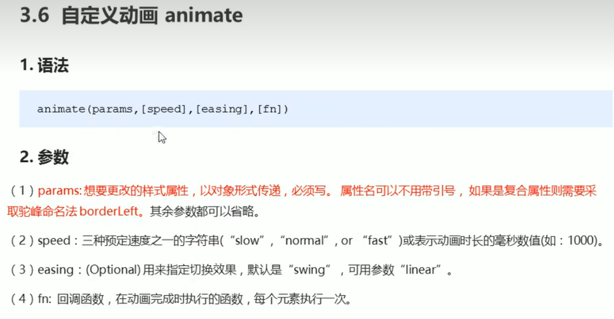
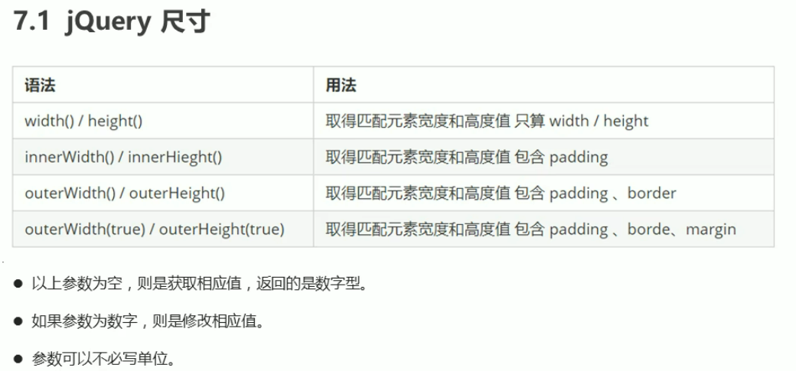

# js库
仓库:可以把很多东西放到这个仓库里面。 找东西只需要到仓库里面查找到就可以了。
JavaScript库:即library ,是一个封装好的特定的集合(方法和函数)。从封装-大堆函数的角度理解库 ,就
是在这个库中,封装了很多预先定义好的函数在里面,比如动画animate、hide、 show ,比如获取元素等。
简单理解:就是一个JS 文件,里面对我们原生js代码进行了封装,存放到里面。这样我们可以快速高效的使用这些封装好的功能了。
# jQuery 概述
为了快速方便的操作DOM ,里面基本都是函数(方法)。
一个js文件用于封装函数，可以调用方法
**优点**
●轻量级。核心文件才几十kb ,不会影响页面加载速度
●跨浏览器兼容。基本兼容了现在主流的浏览器
●链式编程、隐式迭代
●对事件、样式、动画支持,大简化了DOM操作
●支持插件扩展开发。有着丰富的第三方的插件,例如:树形菜单、日期控件、轮播图等
●免费、开源
网站可以下载，有压缩版和开发版jquery.com
## jQuery初使用
### 在元素前面写相关js文件方法
1. 等着页面DOM加载完毕再去执行js代码
```html
$(document) . ready(function() {
$( 'div').hide();
 })
```
2. 等着页面DOM加载完毕再去执行js代码
```html
$(function() {
$( 'div' ).hide();
})
```
1. 等着DOM结构渲染完毕即可执行内部代码,不必等到所有外部资源加载完成, jQuery帮我们完成了封装。
2. 相当于原生js中的DOMContentLoaded.
3. 不同于原生js中的load事件是等页面文档、外部的js文件、css文件、 图片加载完毕才执行内部代码。
## jQuery顶级对象$
1. $是jQuery的别称,在代码中可以使用jQuery代替$,但一般为了方便,通常都直接使用$。
2. $对象是jquery中的顶级对象
## jQuery对象和DOM对象
DOM对象：原生js中获取过来的对象
jQuery对象：用jQuery获取来的对象就是jQuery对象 $( 'div' )就是一个jQuery对象
3. jQuery对象本质是:利用$对DOM对象包装后产生的对象(伪数组形式存储)。
4. jQuery 对象只能使用jQuery方法，DOM对象则使用原生的JavaScirpt 属性和方法
5. jQuery对象不可以使用原生js方法和属性;DOM对象不可以使用jQuery里面封装的方法
### jQuery对象和DOM对象相互转换
因为原生js比jQuery更大,原生的一些属性和方法jQuery没有给我们封装要想使用这些属性和方法需要把
jQuery对象转换为DOM对象才能使用。
1. DOM对象转换为jQuery对象:
```html
$(DOM对象)
$("div")
```
1. jQuery对象转换为DOM对象(两种方式)
 ```html
$("div")[index]  //index是索引号
$("div") .get(index) //index 是索引号
```
# jQuery常用API
## ◆jQuery 选择器
### jQuery基础选择器

### jQuery层级选择器

jQuery设置样式
```html
$("div").css(属性; '值')
```
### 隐式迭代(重要)
遍历内部DOM元素(伪数组形式存储)的过程就叫做隐式迭代。
简单理解:给匹配到的所有元素进行循环遍历,执行相应的方法,而不用我们再进行循环,简化我们的操作，方便我们调用。
### 筛选选择器
  
### jQuery筛选方法
  
### jQuery其他筛选方法
重点记住: parent children find  siblings  eq
### jQuery的排他思想
```html
 // 1. 迭代思想，可以不用for循环就可以给所有按钮绑定事件
        $("button").click(function() {
            // 当前按钮点击可以变背景颜色
            $(this).css('background', 'pink');
            // 将该按钮的其他兄弟们的背景颜色置空
            $(this).siblings("button").css('background', '');
```
### 淘宝精品案例
```html
 $(function() {
            $("#left li").mouseover(function() {
                var index = $(this).index();
                // console.log(index);
                $("#content div").eq(index).show();
                // 将该按钮的其他兄弟们的背景颜色置空
                $("#content div").eq(index).siblings("div").hide();
            })
        })
```
### jQuery链式编程
$(this).css("color", "red").siblings("").css("color", '');
我的颜色是红色,我兄弟的颜色为空
## ◆jQuery 样式操作
1. 参数只写属性名,则是返回属性值
```html
$(this,css("color");
```
2. 参数是属性名,属性值,**逗号分隔**,是设置一组样式,**属性必须加引号**,**值如果是数字可以不用跟单位和引号**
```html
$(this).css("color", "red");
```
3. 参数可以是对象形式,方便设置多组样式。属性名和属性值用冒号隔开,属性可以不用加引号
```html
$(this).css({ "color":"white","font-size":' 20px"});
```
**采用对象形式进行修改样式，复合样式可采用驼峰命名法**
### 设置类样式方法
1. 添加类
```html
$( "div" ).addClass("current");
```
2. 移除类
```html
$( "div" ).removeClass("current' );
```
3. 切换类
```html
$( "div" ).toggleClass("current');
```
**jQuery类操作和原生js中className不同**：
jQuery中添加不会覆盖原来的类，不影响原先的类名
而className中则会覆盖原来的类，只显示新加上的
## ◆jQuery 效果
  
1. 显示语法规范
show ([speed, [easing], [fn]])
2. 显示参数
(1)参数都可以省略，无动画直接显示。
(2)speed:三种预定速度之一 的字符串( "slow"，"normal" , or "fast" )或表示动画时长的毫秒数值(如: 1000)。
(3) easing : (Optional)用来指定切换效果,默认是"swing” , 可用参数"linear" 。
(4) fn:回调函数,在动画完成时执行的函数,每个元素执行次。
### 事件切换
hover([over,]out)
鼠标经过和离开的复合写法over鼠标悬停，out鼠标离开
**如果只写一个函数，鼠标悬停和离开都会触发该函数**
上滑动：slideUp  下滑动：slideDown   滑动切换：slideToggle
### 动画队列及其停止排队方法
1. 动画或效果队列
动画或者效果一旦触发就会执行 ,如果多次触发,就造成多个动画或者效果排队执行。
2. 停止排队
stop()
(1) stop0方法用于停止动画或效果。
(2) 注意: stop(写到动画或者效果的前面，相当于停止结束上一次的动画。
### 淡入淡出效果以及突出显示案例
  
### 自定义动画animate效果
  
### 王者荣耀手风琴案例
①鼠标经过某个小i有两步操作:
②当前小li 宽度变为224px ,同时里面的小图片淡出,大图片淡入
③其余兄弟小Ii宽度变为69px,小图片淡入，大图片淡出
## ◆jQuery 属性操作
### 设置或获取元素固有属性值 prop()
所谓元素固有属性就是元素本身自带的属性，比如 < a > 元素里面的 href ，比如 < input > 元素里面的 type。
1. 获取属性语法
prop(''属性'')
2. 设置属性语法
prop(''属性'', ''属性值'')
### 设置或获取元素自定义属性值 attr()
用户自己给元素添加的属性，我们称为自定义属性。 比如给 div 添加 index =“1”。
1. 获取属性语法
attr(''属性'')      // 类似原生 getAttribute()
2. 设置属性语法
attr(''属性'', ''属性值'')   // 类似原生 setAttribute()
**该方法也可以获取 H5 自定义属性**
### 数据缓存 data()
data() 方法可以在指定的元素上存取数据，并不会修改 DOM 元素结构。一旦页面刷新，之前存放的数据都将被移除。 放在元素内存里面
1. 附加数据语法
data(''name'',''value'')   // 向被选元素附加数据
2. 获取数据语法
date(''name'')             //   向被选元素获取数据
同时，还可以读取 HTML5 自定义属性  data-index ，得到的是数字型
#### data("index")和attr("data-index")的区别
data("index"):返回的是数值型,不用写data-
attr("data-index"):返回的是字符型
### 购物车模块
**全选按钮**
全选思路：里面3个小的复选框按钮（j-checkbox）选中状态（checked）跟着全选按钮（checkall）走。
因为checked 是复选框的固有属性，此时我们需要利用prop()方法获取和设置该属性。
把全选按钮状态赋值给3小复选框就可以了。
当我们每次点击小的复选框按钮，就来判断：
如果小复选框被选中的个数等于3 就应该把全选按钮选上，否则全选按钮不选。
**:checked 选择器      :checked 查找被选中的表单元素。**
## ◆jQuery文本属性值
主要针对元素的内容还有表单的值操作。
### 普通元素内容 html()（ 相当于原生inner HTML)
html()             // 获取元素的内容
html(''内容'')   // 设置元素的内容
### 普通元素文本内容 text()   (相当与原生 innerText)
text()                     // 获取元素的文本内容
text(''文本内容'')   // 设置元素的文本内容
### 表单的值 val()（ 相当于原生value)
val()              // 获取表单的值
val(''内容'')   // 设置表单的值
### 购物车案例
核心思路：首先声明一个变量，当我们点击+号（increment），就让这个值++，然后赋值给文本框。
注意1： 只能增加本商品的数量， 就是当前+号的兄弟文本框（itxt）的值。
修改表单的值是val() 方法
注意2： 这个变量初始值应该是这个文本框的值，在这个值的基础上++。要获取表单的值
减号（decrement）思路同理，但是如果文本框的值是1，就不能再减了。
#### 修改商品小计
核心思路：每次点击+号或者-号，根据文本框的值 乘以 当前商品的价格  就是 商品的小计
注意1： 只能增加本商品的小计， 就是当前商品的小计模块（p-sum）  
修改普通元素的内容是text() 方法
注意2： 当前商品的价格，要把￥符号去掉再相乘 截取字符串 substr(1)
**parents(‘选择器’) 可以返回指定祖先元素**
最后计算的结果如果想要 **保留2位小数 通过 toFixed**(2)  方法
用户也可以直接修改表单里面的值，同样要计算小计。 用表单change事件
用最新的表单内的值 乘以 单价即可  但是还是当前商品小计
## ◆jQuery 元素操作
### 遍历元素
jQuery 隐式迭代是对同一类元素做了同样的操作。 如果想要给同一类元素做不同操作，就需要用到遍历。
**语法1：**
$ ("div").each(function (index, domEle) { xxx; }）
1. each() 方法遍历匹配的每一个元素。主要用DOM处理。 each 每一个
2. 里面的回调函数有2个参数：  index 是每个元素的索引号;  demEle 是每个DOM元素对象，不是jquery对象
3. 所以要想使用jquery方法，需要给这个dom元素转换为jquery对象  $ (domEle)
**语法2：**
$.each(object，function (index, element) { xxx; }）
1. $.each()方法可用于遍历任何对象。主要用于数据处理，比如数组，对象
2. 里面的函数有2个参数：  index 是每个元素的索引号;  element  遍历内容
**遍历对象是对象的话，返回的索引号是属性名，返回的值是属性值，语法2 方便用于遍历对象&数组**
**遍历元素适合用语法1**
### 新建元素
**创建新元素**
```html
$("<li></li>");
```
**添加新元素**
1. 内部添加
在ul里面添加元素li
```html
var li=$("<li></li>");
//新建元素
$("ul").append(li);
//新建元素放在子元素的后面
$("ul").prepend(li);
//新建元素放在子元素的前面
```
2. 外部添加
```html
<div class="text">我是原来的</div>
<script>
    var div=$("<div>我是后妈生的</div>");
    $(".text").after(div);
    //把内容放在目标元素后面
    $(".text").before(div);
    //把内容放在目标元素前面
</script>
```
**内部添加和外部添加的区别**
内部添加是父子关系，外部添加是兄弟关系
**删除元素**
```html
<ul>
    <li>哈哈哈哈，我是king</li>
</ul>
<script>
    $("ul").remove();
    //删除元素匹配元素及其内部所有内容  自杀
    $("ul").empty();
    //删除匹配元素内部的所有子节点，保留自身元素
    $("ul").html("");
    //功能=empty
</script>
```
## ◆jQuery 尺寸、位置操作
### jQuery尺寸

### jQuery位置
1. offset()
offset().top;
offset().left;
**修改距离数值：**
offset({
    top:24,
    left:50
    })
元素在文档中距离页面上和左边距离数值
修改距离文档上和左边距离
1. position()
子盒子距离父盒子的上、左边距离
**该方法只能获取，不能设置**
3. scrollTop()/scrollLeft()
设置或返回元素被卷去的头部或左侧
### 动画效果返回顶部
核心原理： 使用animate动画返回顶部。
animate动画函数里面有个scrollTop 属性，可以设置位置
但是是元素做动画，因此 $ (“body,html”).animate({scrollTop: 0})
**animata只有元素才可以做动画**
# jQuery事件
## jquery事件注册
**单个事件被注册**
语法
```html
element.事件(function(){})   
$(“div”).click(function(){  事件处理程序 })       
```
其他事件和原生基本一致。
比如mouseover、mouseout、blur、focus、change、keydown、keyup、resize、scroll 等
## jquery事件处理
### 事件处理on
on() 方法在匹配元素上绑定一个或多个事件的事件处理函数
element.on(events,[selector],fn)
**语法注意事项**
1. events:一个或多个用空格分隔的事件类型，如"click"或"keydown" 。
2. selector: 元素的子元素选择器 。
3. fn:回调函数 即绑定在元素身上的侦听函数。
```html
 $("div").on({
            click: function() {
                $(this).css("background", "red");
            },
            mouseenter: function() {
                $(this).css("background", "skyblue");
            },
            mouseleave: function() {
                $(this).css("background", "purple");
            }

        })
```
#### on方法优势
1. 可以绑定多个事件，多个处理事件处理程序。
```html
 $(“div”).on({
  mouseover: function(){}, 
  mouseout: function(){},
  click: function(){} 
});       
//如果事件处理程序相同
 $(“div”).on(“mouseover mouseout”, function() {
   $(this).toggleClass(“current”);
  });       
```
2. 可以事件委派操作 。事件委派的定义就是，把原来加给子元素身上的事件绑定在父元素身上，就是把事件委派给父元素。
```html
$("ul").on("click", "a", function() {
                $(this).parent().slideUp(function() {
                    $(this).remove();
                });
```
3. 动态创建的元素，click() 没有办法绑定事件， on() 可以给动态生成的元素绑定事件
```html
 $(function() {
            // 点击发布按钮进行评论发布
            $(".btn").on("click", function() {
                    var li = $("<li></li>");
                    li.html($(".txt").val() + "<a href='javascript:;'>删除</a>");
                    $("ul").prepend(li);
                    li.slideDown();
                    $(".txt").val("");
                })
                // 点击删除则删除评论
            $("ul").on("click", "a", function() {
                $(this).parent().slideUp(function() {
                    $(this).remove();
                });
            })
        })
```
### 事件处理off
解绑事件off，可以移除on添加的事件
```html
$("p").off() // 解绑p元素所有事件处理程序
$("p").off( "click")  // 解绑p元素上面的点击事件 后面的 foo 是侦听函数名
$("ul").off("click", "li");   // 解绑事件委托
```
如果有的事件只想触发一次， 可以使用 one() 来绑定事件。
### 自动触发事件trigger
element.click()  // 第一种简写形式
element.trigger("type") // 第二种自动触发模式
```html
$("p").on("click", function () {
  alert("hi~");
}); 
$("p").trigger("click"); // 此时自动触发点击事件，不需要鼠标点击
```
element.triggerHandler(type)  // 第三种自动触发模式
triggerHandler模式不会触发元素的默认行为，这是和前面两种的区别。
## jquery事件对象
事件被触发，就会有事件对象的产生。
element.on(events,[selector],function(event) {})
阻止默认行为：event.preventDefault()   或者 return  false
阻止冒泡： event.stopPropagation()
### jQuery拷贝对象
把某个对象拷贝给另外一个对象使用 可以使用$.extend方法
语法：
```html
$.extend([deep], target, object1, [objectN])    
```
1. deep: 如果设为true 为深拷贝， 默认为false  浅拷贝 
2. target: 要拷贝的目标对象
3. object1:待拷贝到第一个对象的对象。
4. objectN:待拷贝到第N个对象的对象。
5. 浅拷贝是把被拷贝的对象复杂数据类型中的地址拷贝给目标对象，修改目标对象会影响被拷贝对象。
6. 深拷贝，前面加true， 完全克隆(拷贝的对象,而不是地址)，修改目标对象不会影响被拷贝对象。
### 多库共存
随着jQuery的发展，有别的js库也会使用$ 符号作为标识符，引起冲突。

jQuery $符号作用实质：
```html
$(function(){
    function $(ele){
        return document.querySeletor(ele);
    }
    console.log($("div")); 
})
```
**解决方法**：
1. 如果$ 符号冲突，使用jQuery代替该符号
2. 如果jQuery冲突，jQuery释放$控制权，用户自定义
```html
<script>
    var suibian=jQuery.noConflict();
    console.log(suibian("span"));
    suibian.each();
</script>
    <span></span>
```

### jQuery插件
**jQuery插件常用网站：**
1.  jQuery 插件库  http://www.jq22.com/     
2.  jQuery 之家   http://www.htmleaf.com/  *推荐使用*

**jQuery 插件使用步骤：**
1.  引入相关文件。（jQuery 文件 和 插件文件）    
2.  复制相关html、css、js (调用插件)。
   
#### 瀑布流插件使用
**提高性能模式：**
懒加载：
jQuery 插件库  http://www.jq22.com/  下载引入即可使用
**我们使用jquery 插件库  EasyLazyload。 注意，此时的js引入文件和js调用必须写到 DOM元素（图片）最后面**

**全屏滚动（fullpage.js）**
gitHub： https://github.com/alvarotrigo/fullPage.js
中文翻译网站： http://www.dowebok.com/demo/2014/77/
学会使用方法！！！
# bootstrap js插件使用
bootstrap 框架也是依赖于 jQuery 开发的，因此里面的 js插件使用 ，也必须引入jQuery 文件。
## bootstrap中封装的js插件
1. 自定义属性
不需写 JavaScript 代码也可激活模态框。通过在一个起控制器作用的元素（例如：按钮）上添加 data-toggle="modal" 属性，或者 data-target="#foo" 属性，再或者 href="#foo" 属性，用于指向被控制的模态框。
```html
<button type="button" data-toggle="modal" data-target="#myModal">Launch modal</button>
```
2. jQuery语法调用
只需一行 JavaScript 代码，即可通过元素的 id myModal 调用模态框：
```html
$('#myModal').modal(options)
```
## 阿里百秀

