#  js基础
## js基础介绍
### js是什么
js是客户端（浏览器）的编程语言，实现人机交互效果。
**js的作用**
1. 网页特效（监听用户行为网页做出对应反馈）
2. 表单验证（针对表单合法性进行判断）
3. 数据交互（获取后台数据，渲染到前端）
   
### js有什么
1. ECMAScript：规定js基础语法核心知识（比如：变量、分支语句、循环语句、对象等等）
2. Web APIS
   DOM：操作文档，比如对页面元素进行移动、大小、添加删除等操作
   BOM：操作浏览器，比如页面弹窗，检测窗口宽度、存储数据到浏览器等等
   **权威网站:MDN**

### js书写位置
1. 内联 JavaScript
   代码写在标签内部
   语法： 
   ```html
   <button onclick="alert('逗你玩')">键盘敲烂,月薪过万</button>
   ```
   **注意:** 此处作为了解即可，但是后面vue框架会用这种模式
2. 内部 JavaScript
   先有html再有css再有js
   直接写在html文件里，用script标签包住
   **规范：** script标签写在</ body>上面
   **拓展：**  alert(‘你好，js’) 页面弹出警告对话框
3. 外部 JavaScript
   代码写在以.js结尾的文件里
   **语法：** 通过script标签，引入到html页面中,使用src属性。
   *引入外部js文件,标签内部不允许再有内容,否则会被忽略,不显示.*
   ```html
   <script src="./my.js"></script>
   ```

### js注释
单行：// ctrl+/
多行：/*  */  shift+alt+A
## js基本语法
### js输入输出语法
#### js输出语法
```html
<script>
   // 1. 输出语法，body内输出的内容
   document.write('要输出的内容');
   // 2. 警示框内输出的内容
   alert('张嘉慧');
   // 3. 控制台内输出的语法;通常用来测试
   console.log('控制台打印');
</script>
```
#### js输入语法
```html
<script>
   prompt('要输入的内容');
</script>
```
### 字面量
## 数据类型介绍
### 数据类型简介
js是一种弱类型或者动态语言
**js中的数据变量是根据等号右边的值来确定数据类型的**
js中的数据类型是可以变化的
### 简单数据类型
1. number 数字型，包括整点型值和浮点型值
   *八进制前面是0开头表示，010八进制转化为十进制是8*
   *数字的前面是0x，表示十六进制*
   数字型的最大值Number.MAX_VALUE
   无穷大infinity可以用最大值*2表示
   无穷小infinity可以用-最大值*2表示
   NaN，not a number 代表一个非数值
   数字型的最小值Number.MIN_VALUE
   **isNaN**用来判断是否为非数值，如果是数字，返回FALSE，反之则为true
   

2. Boolean
   只有true和false，参与运算的时候，true为1，false值为0
3. string
   字符串可以表现形式
   ```
   var str="我是'白富美'";
   var str1='我是"白富美"';
   var str2='12';
   ```
   字符串转义符
   | 符号 | 功能   |
   | ---- | ------ |
   | \n   | 换行   |
   | \ \  | 斜杠   |
   | \ '  | 单引号 |
   | \ "  | 双引号 |
   | \ t  | 缩进   |
   | \b   | 空格   |
#### 字符串拼接
**数字相加，字符相连**

4. undefined
   未定义字符类型与字符串相连是字符串
   未定义字符类型与数字相加是非数值，**NaN**
5. null
   空值加数字返回值为原先的数字，空值与字符相连，返回结果是字符
   prompt取过来的值是字符型的
## 数据类型转换
### 转换成字符串类型
| 方式               | 说明                         | 案例                               |
| ------------------ | ---------------------------- | ---------------------------------- |
| toString           | 转换成字符串                 | var num=1;alert(num.string());     |
| String()强制转换   | 转换成字符串                 | var num=1;alert(String(num));      |
| **加号拼接字符串** | 和字符串拼接的结果都是字符串 | var num=1;alert(num+"我是字符串"); |
### 转化成数字型**
| 方式                   | 说明                           | 案例                 |
| ---------------------- | ------------------------------ | -------------------- |
| parseInt(string)函数   | 将string类型转换成整数数值型   | parseInt('78');      |
| parseFloat(string)函数 | 将string类型转换成浮点数数值型 | parseFloat('78.21'); |
| Number强制转换函数     | 将string类型转换成数值型       | Number('12');        |
| js隐式转换(- * /)      | 利用算式运算隐式转换为数值型   | '12'-0               |
### 转换成布尔型
代表空、否定的值会被转换为false ,如"、0、NaN、null、undefined
·其余值都会被转换为true
```
console.log(Boolean ( ' ' )) ; //false
console.log ( Boolean(o) );// false
console.log (Boolean (NaN)) ;// false
console.log(Boolean (null)); // false
console.log (Boolean (undefined) ) ; // false
console.log (Boolean ( '小白')); // true
console.log(Boolean (12)); // true
```
## 标识符、关键字、保留字
标识符：开发人员为为变量、属性、函数、参数取的名字。
**标识符不能是关键字或保留字**
# js运算符
运算符也被称为操作符
## 算术运算符
| 运算符 | 描述   | 实例        |
| ------ | ------ | ----------- |
| +      | 加法   | 10+20=30    |
| -      | 减法   | 20-10=10    |
| *      | 乘法   | 11 * 11=121 |
| /      | 除法   | 33/11=3     |
| %      | 取余数 | 9%2=1       |
## 比较运算符
| 运算符       | 描述                         | 实例           |
| ------------ | ---------------------------- | -------------- |
| ==           | 判等号(会转型)               | 18=='18'       |
| ！=          | 不等号                       | 37！=37(false) |
| = = =、! = = | 全等，要求值和数据类型都一致 | 37===37        |
## 逻辑运算符
| 运算符 | 描述   | 实例                                       |
| ------ | ------ | ------------------------------------------ |
| &&     | 逻辑与 | 两边均为真则为真，一个为假就是假           |
|        | 逻辑或 | 两边只要有一个真就为真，两边都为假，就为假 |
| ！     | 逻辑非 | 取反符，真即为假，假即为真，取相反值       |
### 逻辑与短路运算
表达式1 && 表达式2
如果表达式1为真，则返回表达式2
如果表达式1为假，则返回表达式1
```
console.log(0 && 111); //返回0
console.log(123 && 456); //返回456 
```
### 逻辑中断 逻辑或
表达式1 || 表达式2
如果表达式1为真，则返回表达式1
如果表达式1为假，则返回表达式2
```
console.log(0 || 111); //返回111
console.log(123 || 456); //返回123
```
## 赋值运算符
| 赋值运算符 | 说明                 | 案例                       |
| ---------- | -------------------- | -------------------------- |
| =          | 直接赋值             | var userName='我是用户'    |
| +=、-=     | 加减一个数后再赋值   | var age=10;age+=5;//age=15 |
| *=、/=、%= | 乘、除、取模后再赋值 | var age=2;age *=5;//age=10 |
## 运算符优先级
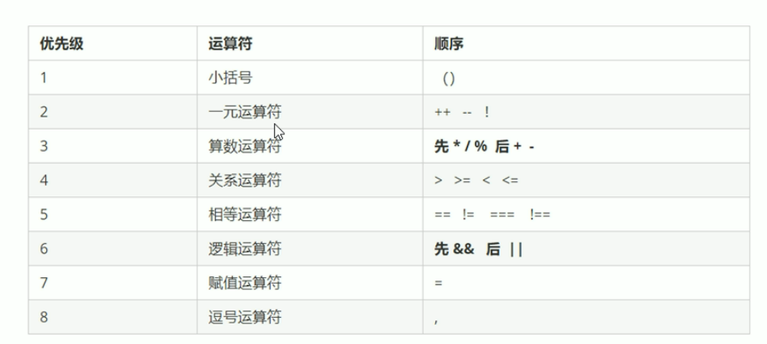
# 流程控制-分支
控制我们的代码按照什么顺序来执行
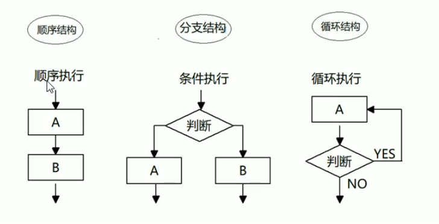
## 顺序结构

## 分支结构
if(判断条件)
{条件成立，执行语句1}；
else{条件不成立，执行语句2 }；
### 三元表达式
条件表达式？表达式1：表达式2；
```
var num=10;
num>5?'是的':'不是的';
//条件表达式真，返回表达式1，否则返回表达式2
```
### switch语句
switch(表达式1){
   case value1:
   执行语句1:
   break;
   case value2:
   执行语句2;
   break; 
   ...
   default:
   执行最后的语句;
}
```
 var num = 2;
        switch (num) {
            case 2:
                alert(2);
                break;
            case 3:
                alert(3);
                break;
            default:
                alert('没有匹配值');
        }
```
**注意事项**
1. 在平常的代码中，经常将表达式写成变量
2. 表达式和value是全等的关系才能完全匹配，否则无匹配值
3. 每个直行语句后面都要有break,否则语句不能中断，全部执行
### switch和if else if语句的区别
1. 一般情况下可以相互转换
2. switch用于判断确定的值，else if用来判断取值范围
3. switch直接跳转到执行语句，而else if是顺序执行语句，**switch语句效率更高一点**
4. 分支比较少的时候，if else if语句的执行效率更高一点
5. 分支多的时候，switch语句的执行效率更高一点，且结构清晰
## 循环结构
### for循环
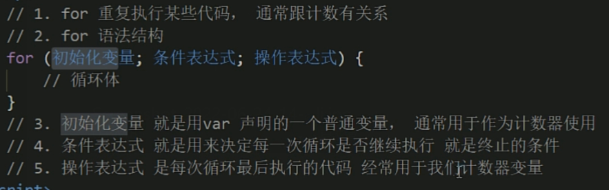
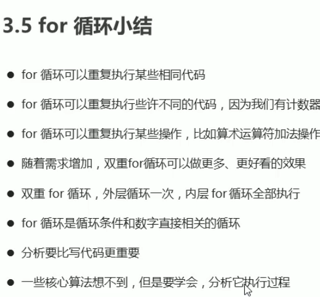
### while循环
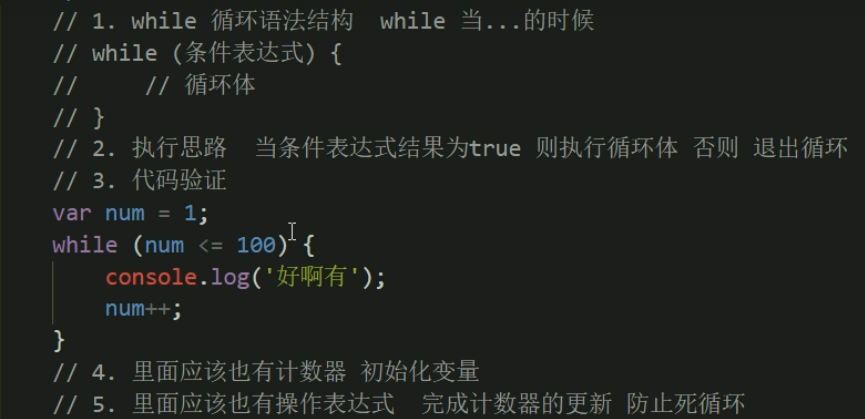
### do while循环
do{
   循环体
}
while(条件表达式)
先执行循环体再判断表达式是否满足条件，如果满足则继续执行循环体，如果不满足，则跳出循环
### continue关键字
在条件判断语句中有continue关键词，满足条件则不继续执行循环体后面的语句，直接跳到操作表达式进行
### break关键字
退出整个循环
## 数组的概念
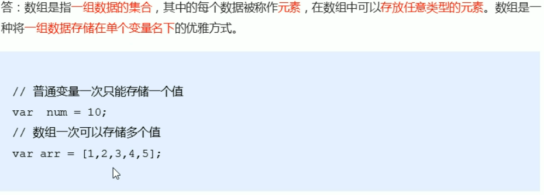
数组长度是元素个数，不要跟索引号混淆，索引号是从0~n-1
数组名.length可以动态监测数组元素个数
**冒泡排序**
```
 var arr = [5, 4, 3, 2, 1];
        var temp = 0;
        for (var i = 0; i < arr.length; i++) {
            for (var j = 0; j < arr.length - i - 1; j++)
                if (arr[j + 1] < arr[j]) {
                    temp = arr[j];
                    arr[j] = arr[j + 1];
                    arr[j + 1] = temp;
                }
        }
```
## 函数的概念
### 声明函数和调用函数
**声明函数**
function 函数名（）{
   函数体
}
```
function sayHi(){
   console.log('Hi~~~');
}//函数名一般是动词
```
*函数只声明，不调用，自己不执行*

**调用函数**
函数名();
### 函数的参数
**1.形参**
function cook(形参1，形参2...){
   函数体；
}
**2.实参**
调用函数
cook(实参1，实参2...);
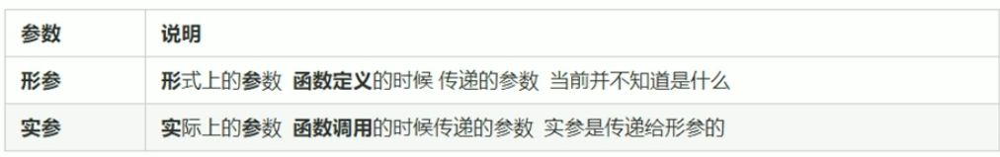
### 函数形参实参个数不匹配问题
1. 实参>形参；会取到形参的个数
2. 实参=形参；正常输出结果
3. 实参<形参；多余的形参定义为undefined,返回结果是NaN
### 函数的返回值
return语句
function 函数名(){
   函数体;
   return 需要返回的结果;
}
函数名();
1. 函数只是实现某种功能，最终的结果只能返回给调用者return语句来实现
```
function cook(aru){
   return aru;
}
cook('大肘子');
console.log(cook('大肘子'));
```
2. 一般来说，我们经常用一个变量来存放返回结果。
```
function getMaxArry(arr) {
            var max = arr[0];
            for (var i = 0; i < arr.length; i++) {
                if (arr[i] > max) {
                    max = arr[i];
                }
            }
            return max;
        }
        var re = getMaxArry([1, 5, 2, 7, 4, 9, 10]);
        console.log(re);
```
**return中止函数**
1. *return后面的代码不再执行*，结束语句
2. return只能返回一个值，如果用逗号隔开则返回最后一个值
3. 返回多个值，可以用数组来存储
4. 函数没有return则返回undefined
### break return continue的区别
break：结束当前循环体
continue：跳出本次循环，继续进行下一次循环
return：不仅可以退出循环，还可以返回return中的值，同时可以结束函数当前体内的代码
## argumennts应用方法（当不知道传递参数是几个的时候使用）
里面用于存储全部实参内容
1. *伪数组：*具有数组的length属性(数组长度)
2. 按照数组索引的方式进行存储
3. 没有真正数组的一些方法pop(),push()等
**有了arguments就不用形参接收传递过来的实参了。**
**只有函数能够使用arguments对象，且每个函数都内置好了该对象**
## 函数的两种声明方式
1. 利用函数关键字自定义函数(命名函数)
```
function fn(){

}
fn();
```
2. 函数表达式(匿名函数)
   ```
   var 变量名=function(){};
   var fun=function(){
      console.log('我是函数表达式');
   }
   fun();
   ```
   **fun是变量名不是函数名**
   **变量里面存储的是值而函数表达式里面存的是函数**
   # js的作用域(es6)
   1. 全局作用域
整个script标签内
   2. 局部作用域
只在函数内部起作用和效果
# 变量的作用域
1. 全局变量
   全局作用域下的变量，全局均可使用
   **注意：在函数内部没有声明直接赋值的变量也是全局变量，例：b=9；**
2. 局部变量
在局部作用域下的变量，在函数内部的变量就是局部变量
**全局变量只有在浏览器关闭的时候才会销毁，比较占内存；局部变量在程序执行完毕就是关闭，节约资源**
*js中没有块级作用域，es6中才新增块级作用域*
## 作用链域
在内部函数里面访问外部函数的变量采取链式查找方式来决定值
**就近原则，站在结果处往外翻**
# js预解析
js引擎运行js分为两步：预解析  代码执行
预解析：js引擎会把js所有的var还有function提升到当前作用域的最前面
代码执行：按照代码书写顺序从上往下执行
## 预解析
预解析分为变量预解析(变量提升)和函数预解析(函数提升)
1. **变量提升**：把所有的变量声明提升到当前作用域的最前面，不提升赋值操作
```
console.log(num);
var num=11;
```
输出结果undefined
预解析执行以下操作：
(1) var num;
(2) console.log(num);
(3) num=11;
```html
fun();
var fun=function(){
   console.log(22);
}//报错
```
相当于执行以下代码：
（1） var fun;
（2）fun();
（3）  fun=function(){
   console.log(22);
}
2. **函数提升**：把所有的函数声明全部调到最前面，但不调用
### 代码执行顺序
1. 预解析
2. 代码执行
3. 分析作用域 
```html
f1();
function f1(){
   var a=b=c=9;
   console.log(a);
   console.log(b);
   console.log(c);
}
   console.log(c);
   console.log(b);
   console.log(a);
```
**var a=b=c=9; 相当于var a=9;b=9;c=9; 因为b，c没有var声明，所以是全局变量**
集体声明格式：var a=9,b=9,c=9;(用逗号隔开)
## js对象
### 对象
是一个具体事物（比如：我的小米手机是对象，但是小米手机不是对象）
js中对象是一组无序的相关属性和方法的集合，所有的事物都是对象，例如字符串、数组、数值、函数等。
**对象由属性方法组成**
属性：事物的特征（常用名词）
方法：事物的行为（常用动词）
#### 利用对象字面量创建对象：var obj={}；(创建空对象)
```html
var obj={
   uname:'张张',
   uage:18,
   usex='女',
   sayHi:function(){
       console.log('hi~');
   }
}
```
对以上函数进行解析
1. 里面属性或者方法我们采用键值对的形式 键 属性名：值 属性值
2. 多个属性或者方法之间用逗号‘，’隔开
3. 方法冒号后面跟的是一个函数（匿名函数）
#### 使用对象
1. 调用对象的属性我们采用 对象名.属性名 console.log(obj.uname);
2. 调用对象的属性第二种格式对象名['属性名']（obj['uname']）
3. 调用对象的方法 对象名.方法名();(例如：obj.sayHi();)
**变量、函数、属性、方法的区别**
变量：必须声明var 且以；结束
属性：存在于对象中，无需声明，以，结束，键值对形式。
函数：需要声明调用方法：函数名（）；
方法：存在于对象中，方法名：+匿名函数，调用方法对象名.方法名();
### 创建对象的三种格式
1. 初始方法：
```html
var obj={
   uname:'张张',
   uage:18,
   usex='女',
   sayHi:function(){
       console.log('hi~');
   }
}
```
2. 利用new Object创建对象 var obj=new Object();//创建空对象
   追加属性obj.uname='张张';
3. 利用构造函数创建
function 构造函数名 （形参）{
   this.属性=值;
   this.方法名=function(){
   }
}
var 对象名=new 构造函数名;
对象名.name;
```html
//构造函数
function Star （uname,age,sex）{
   this.name=uname;
   this.age=age;
   this.sex=sex;
   this.song=function(song){
      console.log(song);
   }
}
//创建对象
var ldh=new Star('刘德华',18,'男');
console.log(ldh.name);
```
1. 构造函数名字首字母要大写
2. 构造函数不需要return返回结果
3. 调用构造函数必须要new
4. 只要new Star调用函数就创造一个对象ldh{}
**构造函数泛指，比如明星；对象指具体的事物，比如刘德华**
**我们利用构造函数创建对象的过程我们也称作对象的实例化**
### new关键字的执行过程
1. new 构造函数可以在内存中创建一个新的对象(生baby)
2. this就会指向刚才创建的新对象(这个baby确定是亲生的)
3. 执行构造函数里面的代码，给这个空对象添加属性和方法(教他读书长大)
4. 返回这个对象(长大挣钱回馈父母)
### 遍历对象属性
for...in 可以对数组或者对象进行循环操作
for(变量 in 对象){

}
```html
for(var k in obj){
   console.log(k);//k 变量输出的是属性名
   console.log(obj[k]);//得到的是属性值
}
```
k得到的是属性名
obj[k]得到的是属性值
# js内置对象操作
(自定义和内置属于js基础内容属于ECMAScript)
## 自定义对象
## 内置对象
js中自带的，并提供一些基本必要的功能方法
优点：帮助我们快速开发
例如：Math、Date、String、Array等
## 浏览器对象(js独有)jsAPI中讲解
# 查文档
学一个内置对象，学会其常用成员即可，其他内容可以看文档W3C/MDN来学习
Mozilla开发者网络( MDN )提供了有关开放网络技术( Open Web )的信息,包括HTML、CSS 和万维网及HTML5应用的API。
**查看文档方法**
1. 查看方法的功能
2. 看参数，[]表示可以有可以没有，查看参数的意义和类型
3. 查看返回值的意义和类型
4. 看示例，进行demo测试
## Math对象
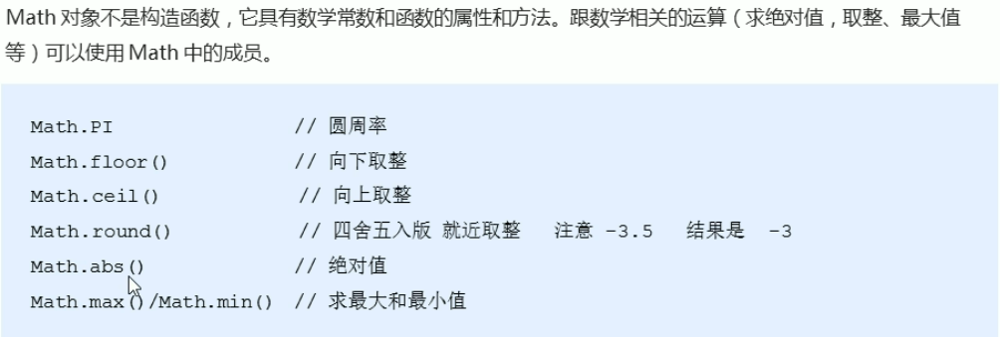
绝对值可以将字符型数字转换成数字型
四舍五入，其他都是正常四舍五入，但是.5比较特殊，往大了取(-1.5四舍五入取值)
封装自己的数学对象
Math.random(随机数)返回一个随机小数 ；这个方法里面不跟参数；
**我们想要得到两个数之间的随机整数，并包含这两个最值**
```html
//Math.floor(Math.random()*(max-min+1))+min;
function getRandom(min,max){
   return Math.floor(Math.random()*(max-min+1))+min;
}
```
## 日期对象
### 格式化日期
Date.();是一个构造函数，必须先实例化才能够使用
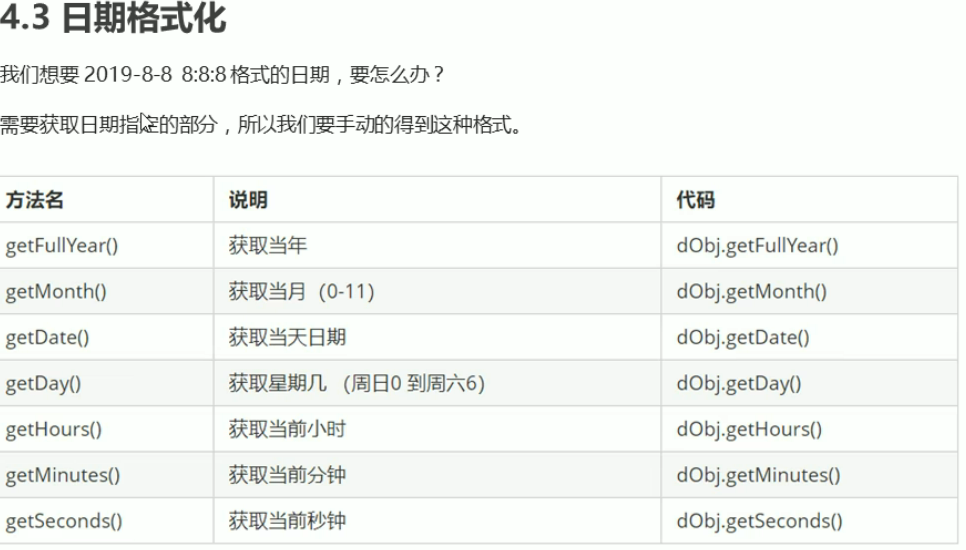
**月份返回值是0-11，所以要在函数返回值后面+1**
**周日返回0，周一到周六返回的1-6**
### 格式化时分秒
**给出的个位数是一位**
### 获得date总的毫秒数(时间戳)
1. 通过valueOf
2. 通过getTime
3. 简单写法var date1=+new Date()
4. H5新增方法 Date.now();
### 倒计时制作方法
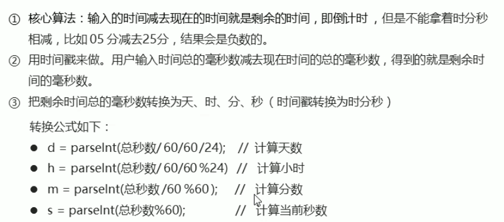
1. 核心算法:输入的时间减去现在的时间就是剩余的时间,即倒计时,但是不能拿着时分秒相减,比如05分减去25分,结果会是负数的。
2. 用时间戳来做。用户输入时间总的毫秒数减去现在时间的总的毫秒数,得到的就是剩余时间的毫秒数。
3. 把剩余时间总的毫秒数转换为天时、分、秒(时间戳转换为时分秒)
转换公式如下: 
d = parselnt(总秒数/ 60/60/24); //计算天数
h= parselnt(总秒数/ 60/60%24) // 计算小时
m= parselnt(总秒数/60 %60); // 计算分数
s = parselnt(总秒数%60);
//计算当前秒数
## 创建数组对象的两种方式
1. 字面量方式
2. new Array()
### 检测是否为数组
1. instanceOf()检测是否为数组
2. Array.isArray();*H5新增方法,ie9以上才支持*
### 添加删除数组元素方法
1. push() 在数组末尾增加一个或多个数组元素 push推（push结束后返回值是数组长度）
2. unshift  在数组前面增加新元素 结束后返回值是数组长度
3. pop 删除数组最后**一个**元素，返回值是删除的元素
4. shift删除数组第一个元素，返回值是删除元素内容
### 数组排序
1. reverse翻转数组
2. sort排序（大->小，小->大）
```html
var arr=[1,3,77,92,38,43];
arr.sort(function(a,b){
   return a-b;//升序
   return b-a;//降序
});
console.log(arr);
```
### 数组索引方法
indexOf():如果存在就返回索引号，不存在就返回-1
lastIndexOf();如果存在就返回索引号，不存在就返回-1
### 数组去重
```html
function unique(arr) {
            var newArr = [];
            for (var i = 0; i < arr.length; i++) {
                if (newArr.indexOf(arr[i]) === -1) {
                    newArr.push(arr[i]);
                }
            }
            return newArr;
        }
        var demo = unique(['a', 'g', 'r', 'q', 'a', 'g']);
        console.log(demo);
```
### 数组转化为字符串
1. toString 将数组转化为字符串 arr.toString();
2. join可以指定分隔符arr.join('-');//默认是逗号
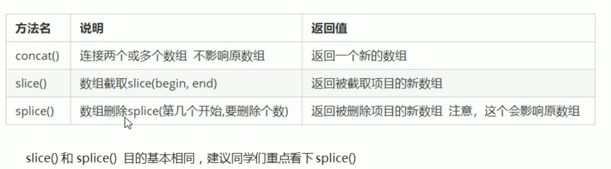
## 字符串变量
### 基本包装类型
String、Number、Boolean
基本包装类型：把简单数据类型包装成复杂数据类型，这样基本数据就有了属性和方法。
**String字符串不可变，变得是字符串地址，每次赋值都新申请一个内存空间进行存储，然后字符串变量指向一个新的内存空间**
### 字符串对象
```html
 var str = "abcoefoxyozzopp";
        var index = str.indexOf('o');
        while (index !== -1) {
            console.log(index);
            index = str.indexOf('o', index + 1);
        }
```
 #### ⭐根据位置返回字符
1. charAt（）
 charAt(index);
 ```html
 var str='andy';
 console.log(str.charAt(3));//返回字符是y
 ```
#### 遍历字符串
```html
var str='andy';
for(var i=0;i<str.length;i++){
   console.log(str.charAt(i));
}
```
2. charCodeAt(index) 返回索引号所在位置存储的字符对应的ASCII
**目的：判断用户按下了哪个键**
3. str[index] 获取指定位置字符，HTML5新增IE8+支持，和charAt等效
#### 统计出现次数最多的字符
```html
 var str = "abcoefoxyozzopp";
var o = {};
        for (var i = 0; i < str.length; i++) {
            var chars = str.charAt(i);
            if (o[chars]) {
                o[chars]++;
            } else {
                o[chars] = 1;
            }
        }
        console.log(o);
```
o[chars]得到的是属性值
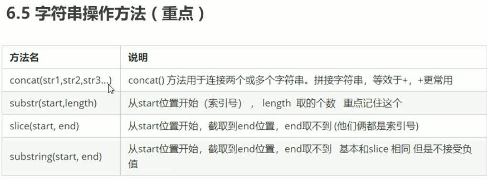
#### 拼接字符
concat('字符串1','字符串2'...);
#### 截取字符串
substr('截取的起始位置','截取几个字符');
#### 替换字符
replace('被替换的字符','替换为的字符');
```html
 var str = "abcoefoxyozzopp";
 for (i = 0; i < str.length; i++) {
            while (str.indexOf('o') !== -1) {
                str = str.replace('o', '*');
            }
        }
        console.log(str);
```
#### 字符转换成数组
split('分隔符');
```html
var str1 = "blue,red,yellow,green";
        str1 = str1.split(',');
        console.log(str1);
```
#### 转换大写
toUpperCase();
#### 转换小写
toLowerCase();
## 简单数据类型(存到栈里面)
开辟一个空间存放值
string number boolean undefined null(返回值是一个空对象)
### 简单数据类型传参
形参改变不影响实参
### 复杂数据类型(存到堆里面)
在栈中开辟一个空间用来存放存储地址，然后根据地址找到存放在堆中的数据
形参改变影响实参；形参实参保存的是同一个地址，所以操作的是同一个对象

