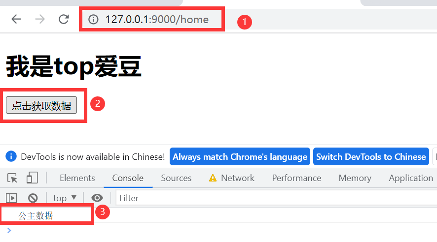
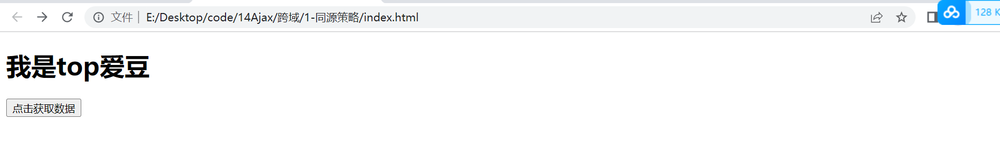
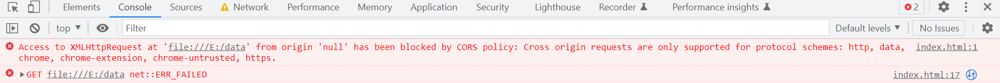

# ajax简介
异步xml和js：可以在浏览器中向服务器发送请求，**最大优势：**无刷新获取数据
## 接口
使用Ajax请求数据时用的URL地址就是数据接口,,同时每个接口必须有请求方式
get post请求流程一致:请求,处理,响应
### 接口测试工具
**常用工具:postman**
#### postman 测试GET接口
1. 选择请求的方式
2. 填写请求的URL 地址
3. 填写请求的参数
4. 点击Send按钮发起GET请求
5. 查看服务器响应的结果
#### postman 测试POST接口
1. 选择请求的方式
2. 填写请求的URL 地址
3. 选择**Body面板并勾选数据格式,勾选对应的数据格式(x-www-form-urlencoded)**
4. 填写要发送到服务器的数据
5. 点击Send按钮发起POST请求
6. 查看服务器响应的结果
## 接口文档
接口的说明文档,是我们调用接口的依据
接口文档包含:对接的URL,参数,以及输出内容的说明,参照接口文档可以知道接口的作用以及接口如何进行调用
### 接口文档组成部分
**接口名称:**用来标识各个接口的简单说明,如登录接口,获取图书列表接口等
**接口地址**URL地址
**调用方式:**GET方式/POST方式
**参数格式:**需要传递的参数,参数名称,参数类型,是否必选,参数说明这4项
**相应格式:**接口的返回值的详细描述,包括数据名称,数据类型,数据说明3项
**返回示例(可选)**:通过对象的形式例举服务器返回数据的结构
## Ajax优点
1. 可以无需刷新页面而与服务器端进行通信。 
2. 允许你根据用户事件来更新部分页面内容
## Ajax缺点
1. 没有浏览历史，不能回退 
2. 存在跨域问题(同源) 
3. SEO 不友好(搜索不友好)

# xml可扩展标记语言
## xml和html的区别
xml：被设计用来传输和存储数据
html：被设计用来呈现数据
XML和HTML类似，不同的是HTML中都是预定义标签，而XML中没有预定义标签，全都是自定义标签，用来表示一些数据。
# http
http协议：超文本传输协议，协议详细规定了浏览器和万维网服务器之间互相通信的规则。
## 请求报文
**重点是格式与参数**
```
行      POST:   /s?ie=utf-8 HTTP/1.1
头      Host:   atguigu. com
        Cookie: name=guigu
        Content-type: applicat ion/ x -www- form- urlencoded
        User-Agent: chrome 83
空行    
体      username=admin&pas sword=admin
```
## 响应报文
```
行      HTTP/1.1  200   OK
头      Content-Type: text/html ; charset=utf-8
        Content- length: 2048
        Content- encoding: gzip
空行
体
    <html>
        <head>
        < /head>
        <body>
           <h1>尚硅谷</h1>
        </body>
    < /html>
```
**如果路由规则中app.get("/server", (request, response) => {// 设置响应});**
路径是第二段路径+/server,则会执行回调函数，将相应内容返回
**看到hxr要想到ajax**
## express框架介绍与使用
npm init --yes //初始化
```
//1. 引入express框架
const express = require("express");
// 2. 创建应用对象
const app = express();
// 3. 创建路由规则
// request是对请求报文的封装
// response是对响应报文的封装
app.get("/", (request, response) => {
  // 设置响应
  response.send("Hello Express!");
});
// 监听端口启动服务
app.listen(8000, () => {
  console.log("服务已经启动，8000 端口监听中......");
});
```
## ajax请求的基本操作
 console.log(xhr.status); //状态码
              console.log(xhr.statusText); //状态字符串
              console.log(xhr.getAllResponseHeaders()); //所有响应头
              console.log(xhr.response); //响应体
## Ajax GET 设置请求参数
xhr.open("GET", "http://127.0.0.1:8000/server?a=100&b=200&c=300");
用?分隔,用&隔开多个参数
## Ajax发送post请求
**js文件**
app.post("/server", (request, response) => {
  // 设置响应头 名字：Access-Control-Allow-Origin 值：*
  // 设置允许跨域
  response.setHeader("Access-Control-Allow-Origin", "*");
  // 设置响应
  response.send("Hello ajax POST!");
});
**html文件**
xhr.open("POST", "http://127.0.0.1:8000/server");
### Ajax post请求 设置请求参数
        xhr.send("123345456");
## Ajax设置请求头信息
xhr.setRequestHeader('Content-Type','application/x-www-form-urlencoded');
Content-Type：设置请求头类型
后面引号里面的是类型值
也可以自定义：
xhr.setRequestHeader('name','helen');
**所有类型的请求都可以响应**
app.all("/server", (request, response) => {
  // 设置响应头 名字：Access-Control-Allow-Origin 值：*
  // 设置允许跨域
  response.setHeader("Access-Control-Allow-Origin", "*");
  response.setHeader("Access-Control-Allow-Headers", "*");
  // 设置响应
  response.send("Hello ajax POST!");
});
## 服务端响应json数据
### 手动转化数据
```
//js文件
//设置响应体
const data = { name: "diamond" };
  let str = JSON.stringify(data);
  response.send(str);
//html文件
let data = JSON.parse(xhr.response);
              result.innerHTML = data.name;
```
### 自动转化数据
```
//html文件
  xhr.responseType = "json";
  result.innerHTML = xhr.response.name;
```
## nodemon工具
npm install -g nodemon
//在终端无法运行首先检查是否在任务栏的空白区域右键进入终端
//检查正确操作后，还无法下载成功，就在开始位置右键选择Windows Power Shell（管理员）进入管理员终端再次输入命令
npm install -g nodemon
//下载后回到vscode运行nodemon server.js 发现仍人不可以运行
//跳出about_Execution_Policies 问题
//直接找到使用 PowerShell 管理执行策略
https://docs.microsoft.com/zh-cn/powershell/module/microsoft.powershell.core/about/about_execution_policies?view=powershell-7.2

## Ajax中IE缓存问题
IE缓存迟疑
加一个时间戳，调用当前时间的响应体内容状态
**增加参数，用?链接 t=Date.now();**
xhr.open("GET", "http://127.0.0.1:8000/ie-server?t=" + Date.now());
## Ajax请求超时与网络异常处理
**html文件**
// 超时2s设置
        xhr.timeout = 2000;
        // 超时回调
        xhr.ontimeout = function () {
          alert("网络异常，请稍后重试！");
        };
        // 网络异常回调
        xhr.onerror = function () {
          alert("你的网络跑路啦！赶紧去检查一下叭！");
        };
**js文件**
setTimeout(() => {
    response.send("延时响应");
  }, 3000);
## Ajax取消请求
   let x = null;
    x = new XMLHttpRequest();
    x.abort();
## Ajax请求重复发送问题
```
let isSending = false;
btns[0].onclick = function () {
        if (isSending) x.abort();
        x = new XMLHttpRequest();
        isSending = true;
        x.open("GET", "http://127.0.0.1:8000/delay");
        x.send();
        x.onreadystatechange = function () {
          if (x.readyState === 4) {
            isSending = false;
          }
        };
      };
      btns[1].onclick = function () {
        x.abort();
      };
```
# 在jQuery中发送Ajax请求
## get请求
bootcdn：查询jquery引入jQuery库
**$.get(url, [data], [callback], [type])**
url:请求的 URL 地址。 
data:请求携带的参数。 
callback:载入成功时回调函数。 
type:设置返回内容格式，xml, html, script, json, text, _default。

## post请求
**$.post(url, [data], [callback], [type])**
url:请求的 URL 地址。 
data:请求携带的参数。 
callback:载入成功时回调函数。 
type:设置返回内容格式，xml, html, script, json, text, _default。
## 通用方法ajax
```
<!-- 先绑定事件再发送请求，触发事件实现服务端响应 -->
$ajax.({
  url:'http://127.0.0.1:8000/delay',
  data:{a:100,b:200},
  type:'GET',
  dataType:'json',
  success:function(data){
    console.log(data);  
    },
  timeout:2000,
  error:function(){
    console.log('出错啦！！！');
  }
```
# axios发送Ajax请求
```
axios.get("/axios-server", {
          params: {
            id: 100,
            vip: 7,
          },
          header: {
            name: "diamond",
            age: 18,
          },
        });
      };
```
# 使用fetch函数发送ajax请求
https://developer.mozilla.org/zh-CN/docs/Web/API/fetch#%E7%A4%BA%E4%BE%8B
**fetch文档**
```
fetch("http://127.0.0.1:8000/fetch-server", {
          method: "POST",
        //   headers: "Diamond",
          body: "username=hhh&password=12345",
        })
          .then((response) => {
            return response.json;
          })
          .then((response) => {
            console.log(response);
          });
```
# Ajax同源策略（跨域）
同源：协议、域名、端口号必须完全相同；违背同源策略就是跨域
网页页面端口和请求端口保持一致，可以简写请求地址，**必须在127.0.0.1:9000/**下才能实现此功能

否则会出现无法获取响应,源地址为空的错误，如下：


## 跨域解决方案1--jsonp
```
<script>
      function handle(data) {
        const result = document.querySelector("#result");
        result.innerHTML = data.name;
      }
    </script>
    <script src="http://127.0.0.1:9000/jsonp-server"></script>
```
jsonp跨域请求:利用函数handle(${str})实现参数返回，此处用end不用send发送响应，不然会报错
```
app.all("/jsonp-server", (request, response) => {
  const data = {
    name: "hhh  ",
  };
  let str = JSON.stringify(data);
  response.end(`handle(${str})`);
});
```
## jQuery发送jsonp请求
**仅支持GET请求**
```
  const data = {
    name: "Diamond",
    city: ["北京", "上海", "河南", "陕西"],
  };
  // 将数据转化为字符串
  let str = JSON.stringify(data);
  let cb = request.query.callback;
  // 返回结果 调用Handel函数
  response.end(`${cb}(${str})`);
});
```
发送请求
```
$.getJSON(
          "http://127.0.0.1:9000/jquery-jsonp-server?callback=?",
          function (data) {
            $("#result").html(`名字:${data.name}<br>
        城市:${data.city}`);
          }
        );
```
## 设置cros响应头实现跨域
CORS 是通过设置一个响应头来告诉浏览器，该请求允许跨域，浏览器收到该响应 以后就会对响应放行
https://developer.mozilla.org/zh-CN/docs/Web/HTTP/Access_control_CORS
跨域资源共享
**特点:**
不需要在客户端做任何特殊的操作，完全在服务器中进行处理，支持 get 和 post 请求
  response.setHeader("Access-Control-Allow-Headers", "*");
  response.setHeader("Access-Control-Allow-Origin", "*");